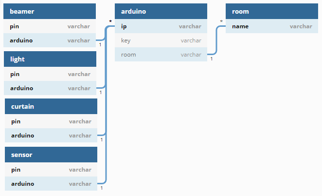

# Domotics | Diario di lavoro - 13.02.2019

##### Ruberto Mattia, Paolo Guebeli, Bosco Giulio

### Canobbio, 13.02.2019

## Lavori svolti

### Giulio

### Mattia

### Paolo

Oggi ho creato il diagramma di base per il DB del sistema di domotica che contiene:
-Le aule
-I arduino
-I componenti dell'arduino

In seguito abbiamo discusso sulla struttura generale del progetto.
Suddividendolo in sei categorie:
- Fisico
- Controllo
- Front-end
- Back-end
- Data
- Logic

##  Problemi riscontrati e soluzioni adottate

##  Punto della situazione rispetto alla pianificazione
In linea con la pianificazione.

## Programma di massima per la prossima giornata di lavoro
Informarsi e capire cosa e come si devono fare le varie cose.
