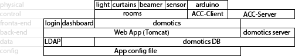

# Domotics | Diario di lavoro - 13.02.2019

##### Ruberto Mattia, Paolo Guebeli, Bosco Giulio

### Canobbio, 13.02.2019

## Lavori svolti

### Giulio

#### Structure

Oggi ho disegnato l'archiettura di sistema dell'intero progetto, quindi ogni modulo e le loro
relazioni.



La quale &egrave; composta dalla struttura di base, la quale carica i vari moduli, sulla quale si
appoggia il livello dei dati (contentente il sistema di accesso tramite LDAP e il DB di domotics),
sopra vi &egrave; il livello del web server Tomcat (con il back-end) ed il server di domotics,
poi vi &egrave; il livello del front-end con i moduli delle varie pagine (login, dashboard, e
domotics). Poi sopra vi sono i sotto moduli del front-end con sopra i moduli degli elementi fisici.

#### LDAP

Poi ho disegnato l'archiettura del modulo di LDAP, che &egrave; composto da una classe di test, per
capire come funziona la connessione di LDAP su Java e per capire quali parametri usare
per collegarsi alla rete del CPT (TestLdapCpt).

Dopo di che &egrave; stata disgnata la classe `LdapConnector`, che verr&agrave; utilizzata per
connettersi facilemente a LDAP con java.

<p style="text-align:center">
    
</p>

Dopo di che ho implementato la classe `LdapConnector` siccome la classe `TestLdapCpt` &egrave; stata
gi&agrave; implementata la scorsa lezione.

```java
/**
 * Get the hashtable environment of the connection.
 *
 * @param username Username of the connection.
 * @param password Password of the connection.
 * @return Hashtable Environment of the connection.
 */
private Hashtable<String, String> getEnvironment(String username, String password) {
    Hashtable<String, String> environment = new Hashtable<String, String>();

    environment.put(Context.INITIAL_CONTEXT_FACTORY, DEFAULT_INITIAL_CONTEXT_FACTORY);
    environment.put(Context.PROVIDER_URL, getConnectionString());
    environment.put(Context.SECURITY_AUTHENTICATION, getSecurity());
    environment.put(Context.SECURITY_PRINCIPAL, getDn(username));
    environment.put(Context.SECURITY_CREDENTIALS, password);

    return environment;
}
```

Il grosso della connessione a LDAP, &egrave; fatto in questo metodo, il quale crea una `Hashtable`,
con tutti parametri che poi verranno inviati con la richiesta ad LDAP.

Ed infine ho scritto il test per la classe nel suo metodo `main`.

### Mattia

### Paolo

Oggi ho creato il diagramma di base per il DB del sistema di domotica che contiene:
-Le aule
-I arduino
-I componenti dell'arduino


In seguito abbiamo discusso sulla struttura generale del progetto.
Suddividendolo in sei categorie:
- Fisico
- Controllo
- Front-end
- Back-end
- Data
- Cofigurazione


##  Problemi riscontrati e soluzioni adottate


##  Punto della situazione rispetto alla pianificazione
In linea con la pianificazione.


## Programma di massima per la prossima giornata di lavoro
Informarsi e capire cosa e come si devono fare le varie cose.
