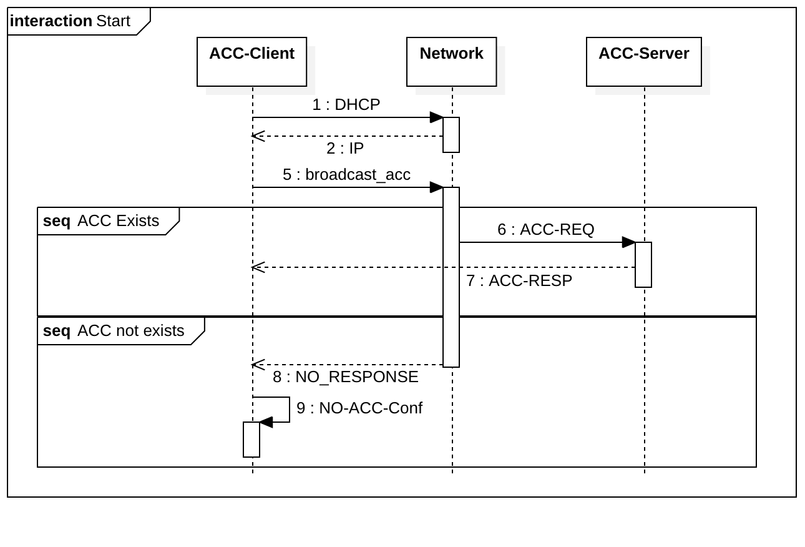
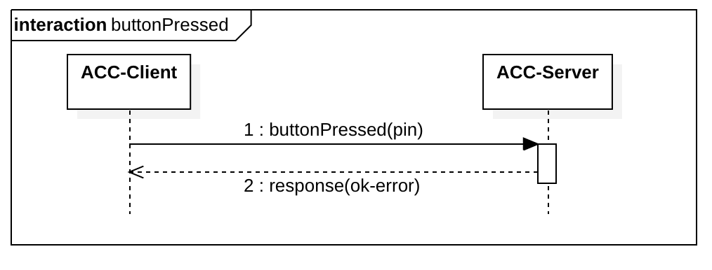
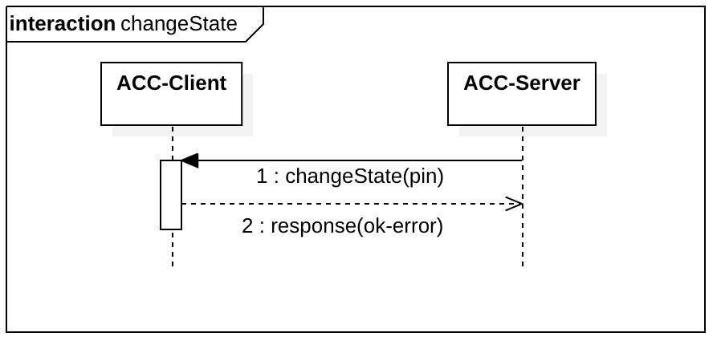
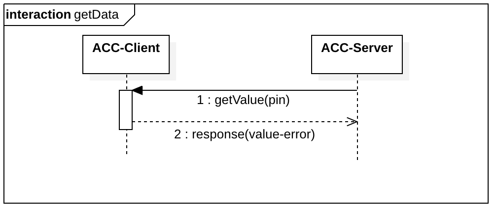
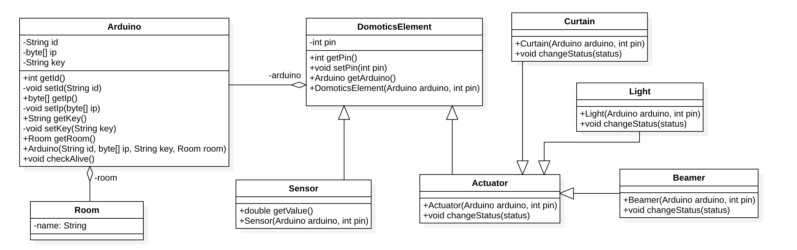

# Domotics | Diario di lavoro - 13.02.2019

##### Ruberto Mattia, Paolo Guebeli, Bosco Giulio

### Canobbio, 13.02.2019

## Lavori svolti

### Giulio

#### ACC Comunicazione

Ho disegnato il flusso di funzionamento del protocollo ACC, tramite un diagramma Swim lane, che
permettono di mostrare il flusso del programma e le interazioni fra le varie macchine, suddividendo
gi&agrave; le varie componenti.

In questo diagramma di pu&ograve; notare la richiesta dhcp dell ACC-Client (Arduino), il quale
quando riceve un IP esegue la broadcast ACC-Server Discover, se riceve una risposta con la sua
configurazione si autoconfigura, altrimenti si mette in modalita no ACC-Server.

In questo diagramma si pu&ograve; notare l'invio del messagio che un bottone &egrave; stato premuto
da parte del ACC-Client verso l'acc server, il quale si preoccuper&agrave; poi di accedere la
lampada corretta.

Nel diagramma soprastante si pu&ograve; notare che l'ACC-Server richiede al client di cambiare lo
stato di un pin.

Nel diagramma si pu&ograve; notare che l'ACC-Server richiede il valore di un determinato pin del
ACC-Client.

#### ACC Dati

Ho Disegnato il diagramma delle classi del modulo ACC-Server, per la parte degli elementi presenti
nell ACC (room, arduino, lights, beamers, curtains and sensors).

### Mattia

### Paolo

##  Problemi riscontrati e soluzioni adottate

##  Punto della situazione rispetto alla pianificazione
In linea con la pianificazione.

## Programma di massima per la prossima giornata di lavoro
Informarsi e capire cosa e come si devono fare le varie cose.
