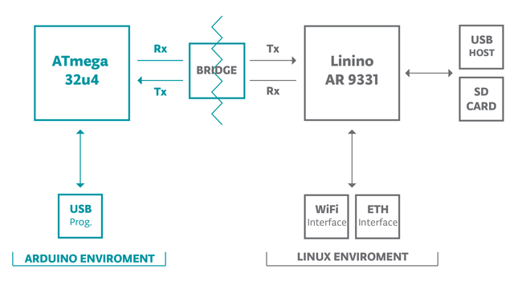

# Domotics | Diario di lavoro - 13.02.2019

##### Ruberto Mattia, Paolo Guebeli, Bosco Giulio

### Canobbio, 13.02.2019

## Lavori svolti

### Giulio

Rigurardato e controllato il design del modulo ACC con Mussi.

Cambiato la password dell'arduino yun, per farlo bisogna caricare il seguente sketch sull'Arduino.
Dopo di che aprire la porta seriale e connettersi ed utilizzzare i comandi di UNIX per cambiare la
password, quindi `passwd`.

```cpp
long linuxBaud = 250000;

void setup() {
  SERIAL_PORT_USBVIRTUAL.begin(115200);  // open serial connection via USB-Serial
  SERIAL_PORT_HARDWARE.begin(linuxBaud); // open serial connection to Linux
}

boolean commandMode = false;

void loop() {
  // copy from USB-CDC to UART
  int c = SERIAL_PORT_USBVIRTUAL.read();    // read from USB-CDC
  if (c != -1) {                            // got anything?
    if (commandMode == false) {             // if we aren't in command mode...
      if (c == '~') {                       //    Tilde '~' key pressed?
        commandMode = true;                 //       enter in command mode
      } else {
        SERIAL_PORT_HARDWARE.write(c);      //    otherwise write char to UART
      }
    } else {                                // if we are in command mode...
      if (c == '0') {                       //     '0' key pressed?
        SERIAL_PORT_HARDWARE.begin(57600);  //        set speed to 57600
        SERIAL_PORT_USBVIRTUAL.println("Speed set to 57600");
      } else if (c == '1') {                //     '1' key pressed?
        SERIAL_PORT_HARDWARE.begin(115200); //        set speed to 115200
        SERIAL_PORT_USBVIRTUAL.println("Speed set to 115200");
      } else if (c == '2') {                //     '2' key pressed?
        SERIAL_PORT_HARDWARE.begin(250000); //        set speed to 250000
        SERIAL_PORT_USBVIRTUAL.println("Speed set to 250000");
      } else if (c == '3') {                //     '3' key pressed?
        SERIAL_PORT_HARDWARE.begin(500000); //        set speed to 500000
        SERIAL_PORT_USBVIRTUAL.println("Speed set to 500000");
      } else if (c == '~') {                //     '~` key pressed?
        SERIAL_PORT_HARDWARE.write((uint8_t *)"\xff\0\0\x05XXXXX\x7f\xf9", 11); // send "bridge shutdown" command
        SERIAL_PORT_USBVIRTUAL.println("Sending bridge's shutdown command");
      } else {                              //     any other key pressed?
        SERIAL_PORT_HARDWARE.write('~');    //        write '~' to UART
        SERIAL_PORT_HARDWARE.write(c);      //        write char to UART
      }
      commandMode = false;                  //     in all cases exit from command mode
    }
  }

  // copy from UART to USB-CDC
  c = SERIAL_PORT_HARDWARE.read();          // read from UART
  if (c != -1) {                            // got anything?
    SERIAL_PORT_USBVIRTUAL.write(c);        //    write to USB-CDC
  }
}
```

[https://www.arduino.cc/en/Guide/ArduinoYun](https://www.arduino.cc/en/Guide/ArduinoYun)  
[http://forum.arduino.cc/index.php?topic=221431.msg1610137#msg1610137](http://forum.arduino.cc/index.php?topic=221431.msg1610137#msg1610137)  
[https://www.arduino.cc/en/Tutorial/Bridge](https://www.arduino.cc/en/Tutorial/Bridge)  

Dopo di che ho cercato di capire come funziona l'arduino yun. Il quale &egrave; composto
principalmente di due componenti, un arduino con la scheda ATmega 32u4, connessa alla porta microUSB
ed ai PIN.  
'altro canto c'&egrave; un chip Linino AR 9331 che esegue Linux OpenWRT che &egrave; una
distro per sistemi embedded, il chip Linino &egrave; collegato alla porta USB tipo A, allo slot per
la scheda microSD, all'interffaccia Wi-Fi ed alla porta Ethernet.  
I due componenti sono collegati tramite un bridge seriale.



Trovato il programma bridge e testato con il pin 13 (on board), eseguendo le richieste via browser
funziona, si accende e si spegne.

```
// richiesta per accedere il led sull'arduino
http://10.20.4.111/cgi-bin/luci/arduino/digital/13/1
// richiesta per spegnere il led sull'arduino
http://10.20.4.111/cgi-bin/luci/arduino/digital/13/0
```

[https://forum.arduino.cc/index.php?topic=231399.0](https://forum.arduino.cc/index.php?topic=231399.0)  
[http://arduinoindiarobomart.blogspot.com/2015/11/in-this-tutorial-we-are-learning-to-how.html](http://arduinoindiarobomart.blogspot.com/2015/11/in-this-tutorial-we-are-learning-to-how.html)  

Creato programma "blink" (ino/blink) per arduino yun, sia la parte di arduino che la parte di linux
in python.

parte arduino:

```cpp
#include <Bridge.h>
#include <stdio.h>

/**
 * Arduino blink on pin 13 sketch.
 *
 * @author giuliobosco (giuliobva@gmail.com)
 * @version 1.0 (2019-03-20 - 2019-03-20)
 */

// Here we will hold the values coming from Python via Bridge
char D13value[2];

void setup() {
  // Zero out the memory we're using for the Bridge
  memset(D13value, 0, 2);

  // Initialize digital pins 12 and 13 as output
  pinMode(13, OUTPUT);

  // Start using the Bridge
  Bridge.begin();
}

void loop() {
  // Write current value of D13 to the pin (basically turning it on or off)
  Bridge.get("D13", D13value, 2);
  int D13int = atoi(D13value);
  digitalWrite(13, D13int);

  // An arbitrary amount of delay to make the whole thing more reliable
  delay(10);
}
```

parte python:

```py
#include <Bridge.h>
#include <stdio.h>

# Arduino blink on pin 13 sketch
#
# @author giuliobosco (giuliobva@gmail.com)
# @version 1.0 (2019-03-20 - 2019-03-20)

import sys
sys.path.insert(0, '/usr/lib/python2.7/bridge')

from time import sleep
from bridgeclient import BridgeClient as bridgeclient

value = bridgeclient()

for idx in range(0, 100):
    value.put('D13','1')
    sleep(0.1)
    value.put('D13','0')
    sleep(0.1)

print("I hope you enjoyed the light show\n")
```

### Mattia

Alla fine il problema del JDBC lo ha risolto Paolo che sapeva come farlo e io mi sono occupato di riorganizzare il trello guardando ciò bisognava fare
e ciò che mancava. Ho guardato poi i cambiamenti che ci sono stati nel git ed in fine mi sono informato su come fare ACC-Server. 

### Paolo

Oggi mi sono occupato di far funzionare JDBC il driver che permette di far comunicare Java e MySql.

Qui troverete la documentazione di come installare i driver suddivisa in ... semplici passaggi.

#### 1 Scaricare i driver adatti a MySql

Per scaricare i driver corretti per MySql andare su questo sito: https://dev.mysql.com/downloads/connector/j/
selezionare il proprio sistema operativo (nel mio caso platform independent) in seguito scaricare la versione
uguale a quella di MySql (consiglio 8.0.15).

#### 2 Creare la classe per leggere i Dati

Bisogna creare una classe base di Java e aggiungere.
```java
import java.sql.*;
```
Per usare i driver bisogna spostare la crtella .jar nella stessa posizione del .class del programma,
aggiungere un collegamento al driver in questo modo:
```java
Class.forName("com.mysql.cj.jdbc.Driver");
```

#### 3 connettersi al Database

Per connetersi al database bisogna usare username e password quindi si dev'essere sicuri che il programma non
sia accessibile a tutti, per connettersi si usa:
```java
Connection con = DriverManager.getConnection("jdbc:mysql://localhost/nomeDatabase", "username", "password");
Statement st = con.createStatement();
```

#### 4 Fare delle Query

Per fare delle Query bisogna semplicemente usare una stringa in sql per esmpio:
```java
String query = "SELECT * FROM dati";
ResultSet rs = st.executeQuery(query);
while(rs.next()){
  String name = rs.getString("name");
}
con.close();
```
Questa porzione di codice ritornerà tutti i nomi nella tabella Dati.

#### Possibili Errori ricevuti

Se vi dice che "Loading class com.mysql.jdbc.Driver. This is deprecated." è perché dalla nuova versione
la stringa dentro Class.forName() contiene cj invece nelle vecchie versione non lo contiene.

Se vi dice che la zona oraria non è valida basta scrivere dentro a MySQl Workbench:
```Sql
SET @@global.time_zone = '+01:00';
SET @@session.time_zone = '+01:00';
```
Nel orario bisogna scrivere la propria zona.


##  Problemi riscontrati e soluzioni adottate


##  Punto della situazione rispetto alla pianificazione
In linea con la pianificazione.


## Programma di massima per la prossima giornata di lavoro
Informarsi e capire cosa e come si devono fare le varie cose.
