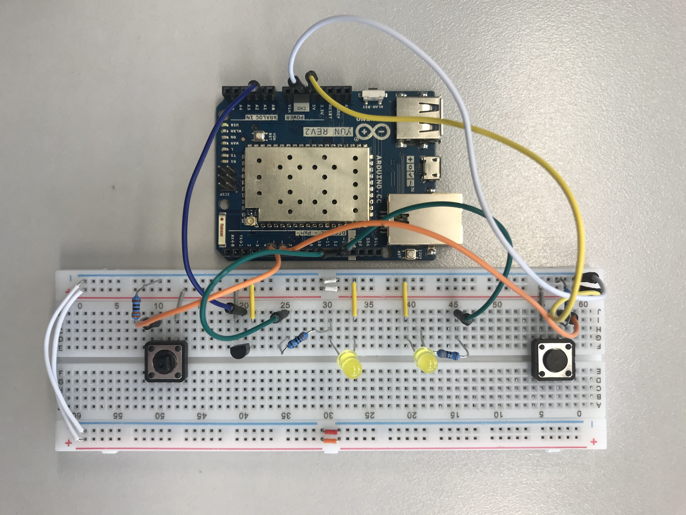

# Domotics | Diario di lavoro - 13.02.2019

##### Ruberto Mattia, Paolo Guebeli, Bosco Giulio

### Canobbio, 10.04.2019

## Lavori svolti

### Giulio

Montato la base degli elementi di domotics sulla breadboard, cio&egrave; due led e due bottoni.



Sul montaggio era gi&agrave; presente anche un sensore di temperatura, il quale faceva andare in
corto circuito l'arduino. Per questo motivo &egrave; stato sostituito con un sensore
`Thermistor Kit(2pcs)`. Il quele &egrave; stato messo in serie ad una resistenza.

**ACC-Client.ino**

Dopo di che ho implementato L'ACC-Client.ino, che funziona correttamente.  
Per i pin di output prende i valori dagli indirizzi di memoria e li aggiorna sui pin.

```cpp
//inizializzo la variabile di buffer
char D13value[2];
// assegno la dimensione al buffer
memset(D13value, 0, 2);
// prendere il valore di d13 e lo inserisco nel buffer
Bridge.get("D13", D13value, 2);
// trasformo in int il valore string
int D9int = atoi(D13value);
// scrivo sul pin output il valore
digitalWrite(13, D13int);
```

https://www.arduino.cc/en/Reference/YunGet

Mentre per i pin di input ho utilizzato due differenti strategie, fra i pin digitali e quelli
analogici, quelli digitali funzionano in maniera simile a quelli di output, con la differenza che
eseguono l'operazione inversa, quindi

```cpp
// inizializzo la variabile di buffer
char D6value[2];
// assegno la dimensione al buffer
memset(D6value, 0, 2);
// prendere il valore del pin 6 e scriverlo nella variabile D6int
int D6int = digitalRead(6);
// trasformare il valore in stringa con buffer
itoa(D6int, D6value, 2);
//scrivo il valore in d6
Bridge.put("D6", D6value);
```

Per arrivare a questa soluzione funzionante ho utilizzato le seguenti pagine
- http://www.cplusplus.com/reference/cstdlib/itoa/
- https://www.arduino.cc/en/Reference/BridgeClientConstructor
- https://forum.arduino.cc/index.php?topic=188998.0
- https://www.arduino.cc/en/Reference/YunPut

Mentre per i pin analogici ho utilizzato una strategia molto piu semplice, trasformare il valore di
input direttamente in una stringa e scriverla nella variabile A0 o A1.

```cpp
// aggiorno stato della variabile con valore della porta
Bridge.put("A0", String(analogRead(0)));
```

Ho trovato questa soluzione su: http://forum.arduino.cc/index.php?topic=286400.0

Mentre dal lato di OpenWRT ho scritto questo semplice script in python che alterna i due led e
stampa sulla console il valore delle porte.

```py
import sys
sys.path.insert(0, '/usr/lib/python2.7/bridge')

from time import sleep
from bridgeclient import BridgeClient as bridgeclient

value = bridgeclient()

while True:
    value.put('D13','1')
    value.put('D12','0')
    value.put('D11','1')
    sleep(0.1)
    value.put('D13','0')
    value.put('D12','1')
    value.put('D11','0')
    sleep(0.1)
    print(value.get('D6') + " " + value.get('D5') + " " + value.get('A0') + " " + value.get('A1'));

```

### Mattia

Malato

### Paolo

Ho aiutato Giulio con il montaggio del Arduino prendendo i componenti che c'erano bisogno.
In seguito ho aggiornato lo schema con i nuovi componenti e ho sistemato il cable managment sullo schema.


##  Problemi riscontrati e soluzioni adottate


##  Punto della situazione rispetto alla pianificazione
In linea con la pianificazione.


## Programma di massima per la prossima giornata di lavoro
Informarsi e capire cosa e come si devono fare le varie cose.
