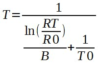
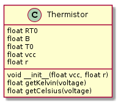
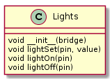

# Domotics | Diario di lavoro - 13.02.2019

##### Ruberto Mattia, Paolo Guebeli, Bosco Giulio

### Canobbio, 12.04.2019

## Lavori svolti

### Giulio

Ho creato la funzione per trasformare il valore del semnsore di temperatura `thermistor` letto sulla
porta dell'arduino in volt, in un valore in gradi cetigradi (Questa operazione verr&agrave; eseguita
in python su OpenWRT). Per trasformare il voltaggio in gradi celsius bisogna utilizzare la seguente
formula:



Che ho trovato su:
https://create.arduino.cc/projecthub/Marcazzan_M/how-easy-is-it-to-use-a-thermistor-e39321
dopo di che ho riscritto la formula presente nella pagina da codice arduino a python

```py
RT0 = 10000                                             # thermistor datasheet values
B = 3977                                                # thermistor datasheet values
# ---
VCC = 5                                                 # supply voltage
R = 10000                                               # resistor: 10kOhm
# ---
T0 = 25 + 273.15                                        # temperature T0 from thermistor datasheet
# ---
VRT = float(bridge.get('A1'))                           # read value of the pin A1 of the arduino
VRT = (5.00 / 1023.00) * VRT                            # conversion to voltage
VR = VCC - VRT                                          # inverse of voltage
RT = VRT / (VR / R)                                     # resistence of RT
# ---
ln = math.log(RT / RT0)                                 # logarithm of RT by RT0
TX = (1 / ((ln / B) + (1 / T0)))                        # temperature on the thermistor
# ---
TX = TX - 273.15                                        # conversion from kelvin to celsius
```

per riscrivire il codice ho dovuto utilizzare qualche accorgimento, come la funzione `log`, che in
python &egrave; nella libreria `math`. Mentre per trasformare la stringa presa dal bridge ho trovato
la soluzione su
https://www.digitalocean.com/community/tutorials/how-to-convert-data-types-in-python-3 che sarebbe
utilizzare la funzione `float("5.1")`, mentre la funzione inversa per poter concatenare un float con
una stringa bisogna utilizzare la funzione `str(4.1)`.

Il datasheet del thermistor &egrave; disponibile al seguente link:
http://www.farnell.com/datasheets/2166231.pdf

Prima ho creato un programma per capire come funziona il senosore `thermistor`, dopo di che ho
implementato il modulo intero. `py/acc_client.py/thermistor`.



Test del modulo (temperatura ambiente: 24°C):

Durante il test del modulo la funzione `getCelsius` non funzionava, mentre quella `getKelvin`
funzionava. La funzione `getCelsius` doveva richiamare la funzione `getKelvin` e sottrargli 273.15,
la sottrazione non veniva eseguita, quindi la funzione era sbagliata. Dopo aver sistemato questo
problema il modulo funziovana correttamente.

Infine ho disegnato il modulo di controllo delle luci dalla parte di Arduino OpenWRT



La quale ha un metodo per settare lo stato dei pin, uno per accendere ed uno per spegnere il pin.

```py
class Lights:
    # create light controller with the arduino bridge
    def __init__(self, bridge):
        self.bridge = bridge

    # light set value
    def lightSet(self, pin = '13', value = '0'):
        self.bridge.put('D' + str(pin), str(value))

    # turn light on
    def lightOn(self, pin = '13'):
        self.lightSet(pin, '1')

    # turn light off
    def lightOff(self, pin = '13'):
        self.lightSet(pin, '0')

```

##  Problemi riscontrati e soluzioni adottate


##  Punto della situazione rispetto alla pianificazione
In linea con la pianificazione.


## Programma di massima per la prossima giornata di lavoro
Informarsi e capire cosa e come si devono fare le varie cose.
