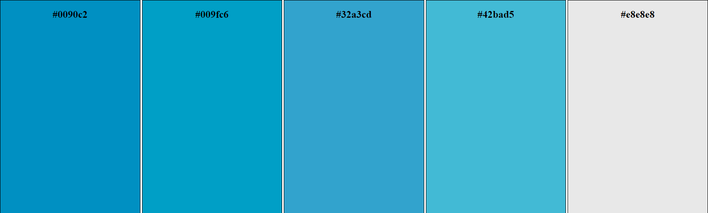

Paolo Guebeli

# Guida di funzionamento e implementazione del frontend

## Stile

Per il frontend abbiamo scelto una paletta di colori di base per tutti i siti.

 
La pagina di login contiene un semplice form composto da un campo testo, un campo password e un pulsante di submit.

La pagina principale &egrave; composta da due parti, la dashboard e il corpo principale contenente le aule.
La dashboard contiene le pagine del sito (al momento solo una) e la gestione del account.
Invece il corpo della pagina permette di gestire le aule, vedere la tempereatura e spegnere/accendere le luci.

## Implementazione
