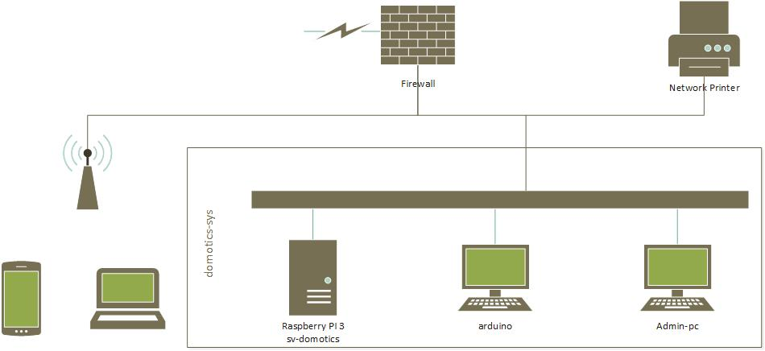
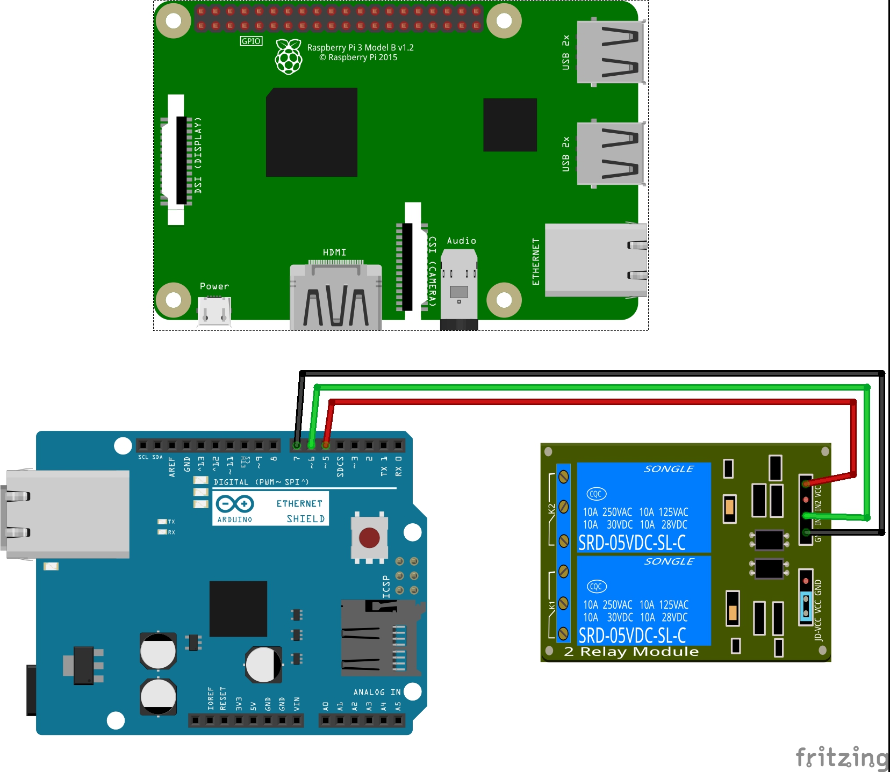

# domotics
home controller

## introduction
### information on the project
INSERIRE ANCORA

### abstract
This file is the documentation of the domotics project, it's an opensource project that is
based on Java, MySQL and Arduino.

- Java is the programming language to interpret the data and to connect the website to arduino.
- MySQL is the database system to store the data.
- Arduino Yún is the microcomputer used to control the relays, motors and manage the sensors.

In this project we need to create a website that manages the domotics in our school rooms,
to do that we connect one Arduino per room. This Arduino will be connected to the lights and the curtains
our webpage is on a Tomcat webserver, from the website you can send a command to the Arduino that receives
it and executes it. You can also from the web site set automatic mode that mnages automatically the Arduino.
The server will also memorize the data of the Arduinos on a MySql based database.

### scope
Lo scopo di questo progetto e di gestire la domotica di diverse aule modularmente tramite arduino e sito web.
Ma i veri scopi principali del progetto sono imparare ad usare nuovi linguaggi/librerie e imparare a lavorare
i gruppo come un team e non come tre singoli individui. Quindi dobbiamo imparare a gestire i tempi delle consegne
e riuscire a suddividere il lavoro equamente evitando di lasciare un componente del team senza lavoro.

### Domain Analysis
Questo prodotto è molto interessante visto che non esistono prodotti simili che possono essere applicati allo stesso
prezzo qui a scuola e ha il vantaggio di essere già interfacciato appositamente per la scuola. In più questo progetto
ha il vantaggio di essere modulare quindi se in futuro si vuole amplire il sito con gli orari e magari una gestione
migliore delle assenze si può fare facilmente.

### Specific Analysis of the requirements

### Planning

#### Project Planning

#### Implementation Planning

### Resources Analysis

#### Software
To carry out this project, has been used many software.
- [StarUML](http://staruml.io/) - (Used for project the database and the procedures)
- [IntelliJ](https://www.jetbrains.com/idea/) - (Used for write the code [HTML CSS JS PHP MySQL])
- [Arduino IDE](https://www.arduino.cc/en/Main/Software) - (Used for write Arduino's Code)
- [NGINX](https://www.nginx.com/) - (Used for the web server)
- [PHP 7.2.3](http://php.net/) - (Used for backend interpreter)
- [MySQL Server](https://www.mysql.com/) - (Used for store data in databases)
- [Raspbian](https://www.raspberrypi.org/downloads/raspbian/) - (OS Used for the server)
- [Fedora](https://getfedora.org/) - (OS Used for develop the project)

#### Hardware
- [Arduino Yún](https://store.arduino.cc/arduino-yun-rev-2)
  - [Relay 1 Channel](https://www.adafruit.com/product/3191)

## Project

### Design of the system architecture
The software store all the data in the MySQL database. PHP is the interpreter from the data to
the user-interface. The relay are commanded by the Arduino, there are tree type of Arduino Shield
that can be used:
- [Arduino UNO](https://store.arduino.cc/usa/arduino-uno-rev3) -
	with Shields ([Ethernet](https://store.arduino.cc/usa/arduino-ethernet-shield-2)
	or [Wifi](https://store.arduino.cc/arduino-wifi-shield))
- [Arduino Ethernet](https://store.arduino.cc/arduino-ethernet-rev3-without-poe)
- [Arduino Wifi](https://store.arduino.cc/arduino-uno-wifi)

### Design of the database

### Design of the interfaces
In the software there is only one interface, the web-app for controls everything.
The web-app is aveable for desktop and for mobile.

#### Login mask

#### Dashboard mask

### Design of the procedures
In this project there are some procedures:
- login mask > database
- database data > views
- views > arduino

## Implementation
This project is expendables, so for test we just implemented width only one relay.
In the first version (1.0) there remote sensor controls is not available and also the management
of the system.
The main control server runs on a Raspberry PI 3, this is connected to lan of the structure,
on the same lan have to be connected the Arduino Ethernet or Wi-Fi.
Insert in the database the users, groups, rooms, stations (= Arduino) and the relay details.

### network schema

### circuit schema

## Tests
For test the project there will be used the domotics web app from a smartphone
(for check responsive) and from one desktop computer. It well be tried to turn off and on from
two different users a relay.

 User | Begin Status | After status
 --- | --- | ---
`rosso` | on | off
`user2` | off | on

The whole domotics system works correctly.
