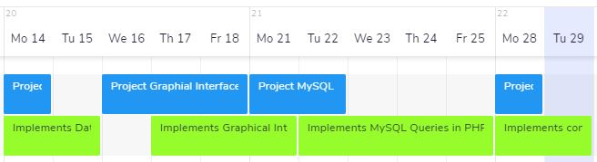
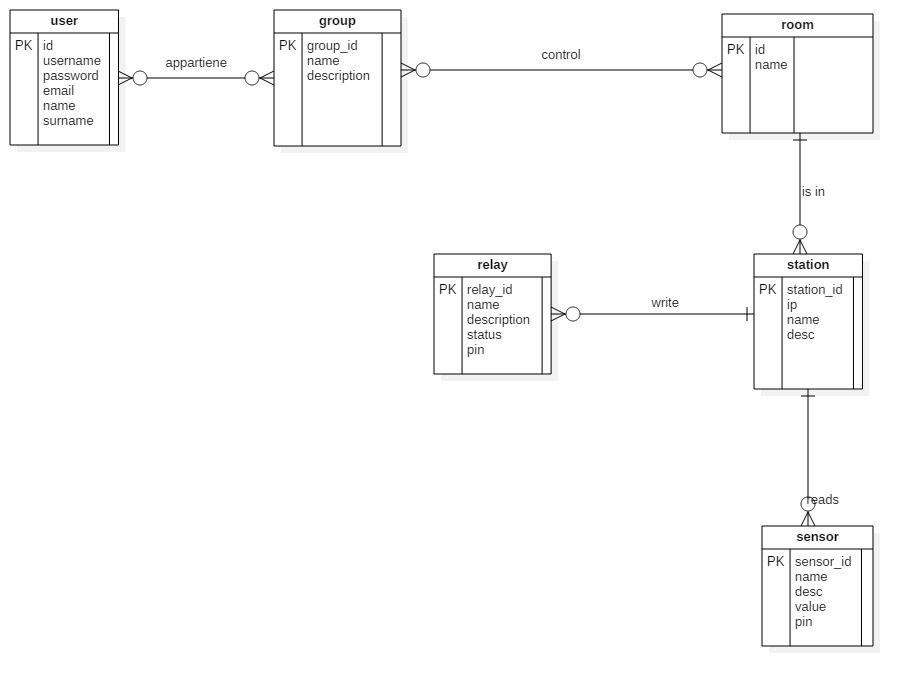
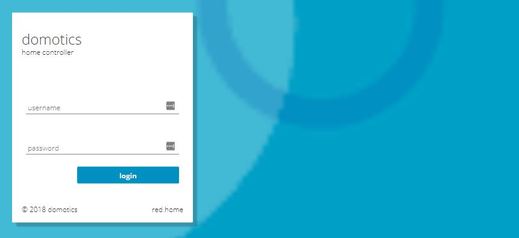
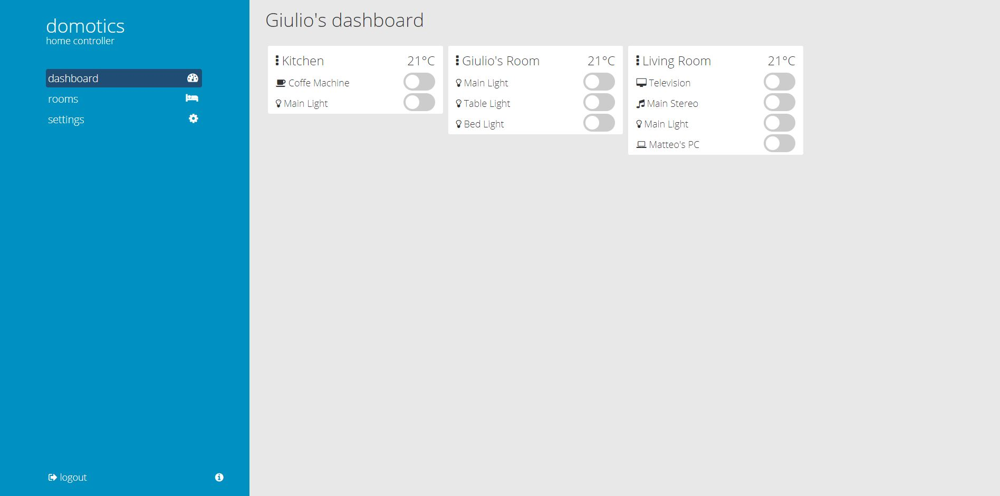

# domotics
home controller

## introduction
### information on the project
INSERIRE ANCORA

### abstract 
In this there is the documentation of the domotics project, domotics an opensource domotics system
based on PHP, MySQL and Arduino. 

- PHP is the programming language for interpret the data.
- MySQL is the database system for store the data.
- Arduino is the microcomputer used for control the relays and manage the sensors datas.

### scope
The scope of the project is make domotics a house with a normal eletrical plan with low costs
and also is the final project of Giulio Bosco for the Modulo 121 (Implementare funzioni di 
controllo - [Scuola Arti e Mestieri di Trevano](https://www.cpttrevano.ti.ch/)). 

### Domain Analysis 
This product well be used in houses or buildings where is unavailable a domotic system. 
The contest where the product well be used is structured by rooms, elements in rooms, people 
and groups of peoples.

Actually there are many products like this. There are two kind of products, home made products,
or complicated systems produced by big companies. All the home made products are not very good 
documented and big's products are too much expensive. 

The users of the products are normal people, with no IT knowledge. They need a easy and useful 
interface. For install the products is required a base of knowledge of web development, 
systems management and electronics. For install the main server, do small changes of the 
interface for adapt at the smallest needs.

### Specific Analysis of the requirements
The product needs to be easy to use. 
INSERT MORE

### Planning

#### Project Planning
- Project Database (14.05)
- Project Graphical Interface Design (16.05-18.05)
- Project MySQL Queries (21.05-22.05)
- Project connectino Arduino <-> PHP
  
#### Implementation Planning
- Implements Database And Run Tests (14.05-15.05)
- Implements Graphical Interface (17.05-21.05)
- Implements MySQL Queries in PHP (22.05-25.05) 
- Implements connection Arduinio <-> PHP (28.05-29.05)

### Resources Analysis

#### Software
To carry out this project, has been used many software.
- [StarUML](http://staruml.io/) - (Used for project the database and the procedures)
- [PhpStorm](https://www.jetbrains.com/phpstorm/) - (Used for write the code [HTML CSS JS PHP MySQL])
- [Arduino IDE](https://www.arduino.cc/en/Main/Software) - (Used for write Arduino's Code)
- [NGINX](https://www.nginx.com/) - (Used for the web server)
- [PHP 7.2.3](http://php.net/) - (Used for backend interpreter)
- [MySQL Server](https://www.mysql.com/) - (Used for store data in databases)
- [Raspbian](https://www.raspberrypi.org/downloads/raspbian/) - (OS Used for the server)
- [Fedora](https://getfedora.org/) - (OS Used for develop the project)

#### Hardware
- [Arduino UNO / Genuino UNO (with alimentator)](https://store.arduino.cc/arduino-uno-rev3)
  - [Arduino Ethernet Shield](https://store.arduino.cc/arduino-ethernet-shield-2) 
  - [Relay 1 Channel](https://www.adafruit.com/product/3191)
  - [Jumpers 150mm (Male To Female)](https://store.arduino.cc/10-jumper-wires-150mm-male)
- [Raspberry PI 3 (with alimentator)](https://www.raspberrypi.org/)
- [NETGEAR Switch](http://www.netgear.com/home/products/networking/switches/soho-ethernet-switches/default.aspx)

## Project

### Design of the system architecture
The software store all the data in the MySQL database. PHP is the interpreter from the data to 
the user-interface. The relay are commanded by the Arduino, there are tree type of Arduino Shield
that can be used: 
- [Arduino UNO](https://store.arduino.cc/usa/arduino-uno-rev3) - 
	with Shields ([Ethernet](https://store.arduino.cc/usa/arduino-ethernet-shield-2) 
	or [Wifi](https://store.arduino.cc/arduino-wifi-shield))
- [Arduino Ethernet](https://store.arduino.cc/arduino-ethernet-rev3-without-poe)
- [Arduino Wifi](https://store.arduino.cc/arduino-uno-wifi)

### Design of the database

### Design of the interfaces
In the software there is only one interface, the web-app for controls everything.
The web-app is aveable for desktop and for mobile. 

#### Login mask

#### Dashboard mask

### Design of the procedures
In this project there are some procedures:
- login mask > database
- database data > views
- views > arduino