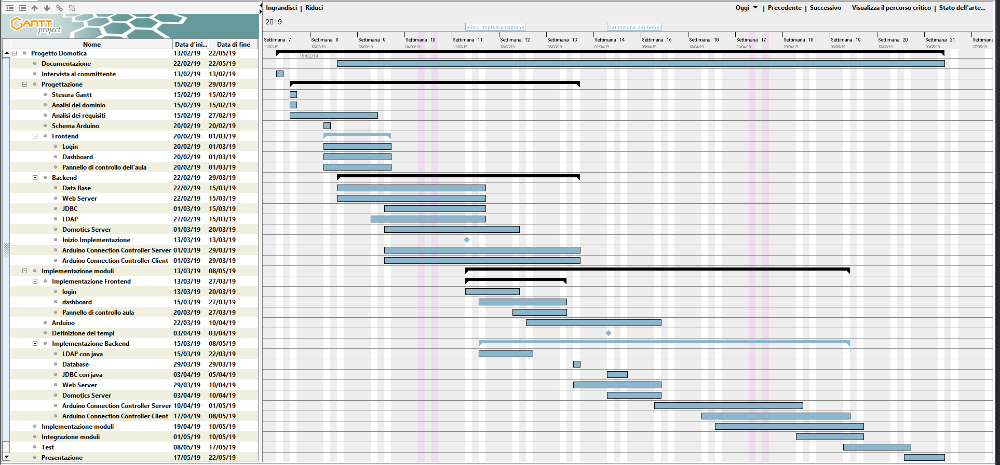

<style>
th, td {
    padding:2px 5px!important;
}
</style>

# Domotizzazione dell'aula

## Indice

<div class="clearfix index">
    <div class="capitle" style="width:80%;float:left;border-bottom:1px dotted #DDDDDD;"><h5>Capitolo</h5></div>
    <div class="page" style="text-align:right;width:20%;float:left;border-bottom:1px dotted #DDDDDD;"><h5>Pagina</h5></div>
    <div style="margin-top:5px;widht:100%;"> </div>
    <div class="capitle" style="width:80%;float:left;border-bottom:1px dotted #DDDDDD;">1 Introduzione</div>
        <div class="page" style="text-align:right;width:20%;float:left;border-bottom:1px dotted #DDDDDD;">3</div>
        <div style="margin-top:5px;widht:100%;"> </div>
        <div class="capitle" style="width:80%;float:left;border-bottom:1px dotted #DDDDDD;">&emsp;1.1 Informazione sul progetto</div>
        <div class="page" style="text-align:right;width:20%;float:left;border-bottom:1px dotted #DDDDDD;">3</div>
        <div style="margin-top:5px;widht:100%;"> </div>
        <div class="capitle" style="width:80%;float:left;border-bottom:1px dotted #DDDDDD;">&emsp;1.2 Abstrat</div>
        <div class="page" style="text-align:right;width:20%;float:left;border-bottom:1px dotted #DDDDDD;">3</div>
        <div style="margin-top:5px;widht:100%;"> </div>
        <div class="capitle" style="width:80%;float:left;border-bottom:1px dotted #DDDDDD;">&emsp;1.3 Scopo</div>
    <div class="page" style="text-align:right;width:20%;float:left;border-bottom:1px dotted #DDDDDD;">4</div>
        <div class="capitle" style="width:80%;float:left;border-bottom:1px dotted #DDDDDD;">&emsp;1.4 Analisi del dominio</div>
        <div class="page" style="text-align:right;width:20%;float:left;border-bottom:1px dotted #DDDDDD;">4</div>
        <div class="capitle" style="width:80%;float:left;border-bottom:1px dotted #DDDDDD;">&emsp;1.5 Analisi e specifica dei requisiti</div>
        <div class="page" style="text-align:right;width:20%;float:left;border-bottom:1px dotted #DDDDDD;">4</div>
        <div class="capitle" style="width:80%;float:left;border-bottom:1px dotted #DDDDDD;">
            &emsp;1.6 Pianificazione
        </div>
            <div class="page" style="text-align:right;width:20%;float:left;border-bottom:1px dotted #DDDDDD;">7</div>
        <div class="capitle" style="width:80%;float:left;border-bottom:1px dotted #DDDDDD;">&emsp;1.7 Analisi dei mezzi</div>
        <div class="page" style="text-align:right;width:20%;float:left;border-bottom:1px dotted #DDDDDD;">6</div>
            <div class="capitle" style="width:80%;float:left;border-bottom:1px dotted #DDDDDD;">
                &emsp;&emsp;1.7.1Software
            </div>
            <div class="page" style="text-align:right;width:20%;float:left;border-bottom:1px dotted #DDDDDD;">6</div>
            <div class="capitle" style="width:80%;float:left;border-bottom:1px dotted #DDDDDD;">
                &emsp;&emsp;1.7.2Hardware
            </div>
            <div class="page" style="text-align:right;width:20%;float:left;border-bottom:1px dotted #DDDDDD;">6</div>
    <div class="capitle" style="width:80%;float:left;border-bottom:1px dotted #DDDDDD;">
        2 Progettazione
    </div>
    <div class="page" style="text-align:right;width:20%;float:left;border-bottom:1px dotted #DDDDDD;">8</div>
        <div class="capitle" style="width:80%;float:left;border-bottom:1px dotted #DDDDDD;">
            &emsp;2.1 Architettura del progetto
        </div>
        <div class="page" style="text-align:right;width:20%;float:left;border-bottom:1px dotted #DDDDDD;">5</div>
            <div class="capitle" style="width:80%;float:left;border-bottom:1px dotted #DDDDDD;">
                &emsp;&emsp;2.2 Design dell'interfaccia di login
            </div>
            <div class="page" style="text-align:right;width:20%;float:left;border-bottom:1px dotted #DDDDDD;">8</div>
            <div class="capitle" style="width:80%;float:left;border-bottom:1px dotted #DDDDDD;">
                &emsp;&emsp;2.3 Design della dashboard del sito web
            </div>
            <div class="page" style="text-align:right;width:20%;float:left;border-bottom:1px dotted #DDDDDD;">10</div>
            <div class="capitle" style="width:80%;float:left;border-bottom:1px dotted #DDDDDD;">
                &emsp;&emsp;2.4 Architettura Database
            </div>
            <div class="page" style="text-align:right;width:20%;float:left;border-bottom:1px dotted #DDDDDD;">11</div>
            <div class="capitle" style="width:80%;float:left;border-bottom:1px dotted #DDDDDD;">
                &emsp;&emsp;2.6 Architettura Arduino Yun
            </div>
            <div class="page" style="text-align:right;width:20%;float:left;border-bottom:1px dotted #DDDDDD;">11</div>
            <div class="capitle" style="width:80%;float:left;border-bottom:1px dotted #DDDDDD;">
                &emsp;&emsp;2.7 Arduino Connection Controller Client
            </div>
            <div class="page" style="text-align:right;width:20%;float:left;border-bottom:1px dotted #DDDDDD;">11</div>
            <div class="capitle" style="width:80%;float:left;border-bottom:1px dotted #DDDDDD;">
                &emsp;&emsp;2.8 Arduino Connection Controller Server
            </div>
            <div class="page" style="text-align:right;width:20%;float:left;border-bottom:1px dotted #DDDDDD;">11</div>
    <div class="capitle" style="width:80%;float:left;border-bottom:1px dotted #DDDDDD;">
        3 Implementazione
    </div>
    <div class="page" style="text-align:right;width:20%;float:left;border-bottom:1px dotted #DDDDDD;">12</div>
        <div class="capitle" style="width:80%;float:left;border-bottom:1px dotted #DDDDDD;">
            &emsp;3.1 Login del sito web
        </div>
        <div class="page" style="text-align:right;width:20%;float:left;border-bottom:1px dotted #DDDDDD;">14</div>
        <div class="capitle" style="width:80%;float:left;border-bottom:1px dotted #DDDDDD;">
            &emsp;3.2 Dashboard del sito weblogSensor
        </div>
        <div class="page" style="text-align:right;width:20%;float:left;border-bottom:1px dotted #DDDDDD;">15</div>
        <div class="capitle" style="width:80%;float:left;border-bottom:1px dotted #DDDDDD;">
            &emsp;3.3 Database
        </div>
        <div class="page" style="text-align:right;width:20%;float:left;border-bottom:1px dotted #DDDDDD;">16</div>
        <div class="capitle" style="width:80%;float:left;border-bottom:1px dotted #DDDDDD;">
            &emsp;3.4 Lightweight Directory Access Protocol
        </div>
        <div class="page" style="text-align:right;width:20%;float:left;border-bottom:1px dotted #DDDDDD;">33</div><div class="page-break"></div>
    <div class="capitle" style="width:80%;float:left;border-bottom:1px dotted #DDDDDD;">
        4 Test
    </div>
    <div class="page" style="text-align:right;width:20%;float:left;border-bottom:1px dotted #DDDDDD;">35</div>
        <div class="capitle" style="width:80%;float:left;border-bottom:1px dotted #DDDDDD;">
            &emsp;4.1 Protocollo di test
        </div>
        <div class="page" style="text-align:right;width:20%;float:left;border-bottom:1px dotted #DDDDDD;">35</div>
        <div class="capitle" style="width:80%;float:left;border-bottom:1px dotted #DDDDDD;">
            &emsp;4.2 Risultati test
        </div>
        <div class="page" style="text-align:right;width:20%;float:left;border-bottom:1px dotted #DDDDDD;">42</div>
    <div class="capitle" style="width:80%;float:left;border-bottom:1px dotted #DDDDDD;">
        Consuntivo
    </div>
    <div class="page" style="text-align:right;width:20%;float:left;border-bottom:1px dotted #DDDDDD;">43</div>
    <div class="capitle" style="width:80%;float:left;border-bottom:1px dotted #DDDDDD;">
        5 Conclusioni
    </div>
    <div class="page" style="text-align:right;width:20%;float:left;border-bottom:1px dotted #DDDDDD;">44</div>
        <div class="capitle" style="width:80%;float:left;border-bottom:1px dotted #DDDDDD;">
            &emsp;5.1 Sviluppi futuri
        </div>
        <div class="page" style="text-align:right;width:20%;float:left;border-bottom:1px dotted #DDDDDD;">44</div>
        <div class="capitle" style="width:80%;float:left;border-bottom:1px dotted #DDDDDD;">
            &emsp;5.2 Considerazioni personali
        </div>
        <div class="page" style="text-align:right;width:20%;float:left;border-bottom:1px dotted #DDDDDD;">44</div>
        <div class="capitle" style="width:80%;float:left;border-bottom:1px dotted #DDDDDD;">
            &emsp;5.3 Sitografia
        </div>
        <div class="page" style="text-align:right;width:20%;float:left;border-bottom:1px dotted #DDDDDD;">44</div>
    <div class="capitle" style="width:80%;float:left;border-bottom:1px dotted #DDDDDD;">
        6 Allegati
    </div>
    <div class="page" style="text-align:right;width:20%;float:left;border-bottom:1px dotted #DDDDDD;">44</div>
</div>

## 1 Introduzione

### 1.1 Informazioni sul progetto

Questo progetto è stato assegnato dal docente Francesco Mussi il 13.02.2019 agli allievi del terzo anno della scuola arti e mestieri Trevano. Mattia Ruberto, Giulio Bosco e Paolo Gübeli sono i membri del gruppo che si occupano del progetto. La scadenza del progetto è fissata per il 17.05.2019.

### 1.2 Abstract

This project started from the fact that the lighting switches of the school of arts and crafts of Trevano are placed in the classroom in clumsy and uncomfortable places so we decided to implement an application that would allow you to manage lights, curtains and beamer through a website that allows you to adjust the various components of the classroom. In short, it is a domotization of the classrooms that in this way can be controlled remotely.

### 1.3 Scopo

Lo scopo del progetto è quello di domotizzare le aule della scuola arti e mestieri Trevano. Per domotizzazione delle aule si intende la possibilità di poter gestire le luci, il beamer e le tende delle aule tramite un sito web in cui vengono rappresentate le aule con tutti i valori modificabili. In questo sito web ci sarà un sistema di login da cui potranno accedere solo i docenti.

### 1.4 Analisi del dominio

Questa applicazione permette di controllare a distanza luci, tende e beamer delle aule delle scuole. Infatti il suo contesto principale di utilizzo sono proprio le scuole dato che è un sistema molto semplice e a basso prezzo che fa proprio a caso delle scuole. Infatti l'idea è di implementare e testare quest'applicazione inizialmente in una singola aula dopdichè se funziona bene si può implementarlo in tutte le aule della scuola. Prodotti simili esistono già ma non specifici per le aule del CPT, inoltre il nostro sistema va ad interagire direttamente con il server della scuola per controllare chi di quelli che fa il login è un docente e quindi chi di essi potrà accedere al pannello di controllo o no. Senza il nostro prodotto gli utenti delle varie aule, docenti e allievi tribulano di continuo con i pulsanti delle luci che funzionano a caso.  

### 1.5 Analisi e specifica dei requisiti

Questi sono i requisiti iniziali, dato che all'inizio avevamo programmato di riuscire a fare tutto. Ma durante lo sviluppo del progetto ci siamo accorti che le cose da fare erano tante di cui la maggior parte tutte cose che non avevamo mai visto quindi abbiamo deciso di cambiare le priorità di alcuni requisiti.

Requisiti cambiati:
-   Simulazione tende
    * Priorità: 1 => 3    
-   Modulo luci
    * Priorità: 1 => 3    
-   Modulo tende  
    * Priorità: 1 => 3
-   Modulo beamer
    * Priorità: 1 => 3     


|		   |ID: REQ-01    |	    		             |
|:---------|:-------------|:-------------------------|
|Nome:     |Pagina di login                         ||
|Priorità: |1                                       ||
|Versione: |1.0                                     ||
|Note:     |                                        ||
|          |Sotto requisiti                          |
|001:      |Input username e password               ||

<br>

|		   |ID: REQ-02    |	    		             |
|:---------|:-------------|:-------------------------|
|Nome:     |Pagina gestione aule                    ||
|Priorità: |1                                       ||
|Versione: |1.0                                     ||
|Note:     |                                        ||
|          |Sotto requisiti                          |
|001:      |Modificare lo stato delle luci          ||
|002:      |Modificare lo stato delle tende         ||
|003:      |Modificare lo stato del beamer          ||

<br>

|		   |ID: REQ-03    |	    		             |
|:---------|:-------------|:-------------------------|
|Nome:     |Web Server                              ||
|Priorità: |1                                       ||
|Versione: |1.0                                     ||
|Note:     |                                        ||
|          |Sotto requisiti                          |
|001:      |Gestione della parte web                ||

<br>

|		   |ID: REQ-04    |	    		             |
|:---------|:-------------|:-------------------------|
|Nome:     |Server in Python                        ||
|Priorità: |1                                       ||
|Versione: |1.0                                     ||
|Note:     |                                        ||
|          |Sotto requisiti                          |
|001:      |Gestione dell'automatizzazione          ||

<br>

|		   |ID: REQ-05    |	    		                      |
|:---------|:-------------|:----------------------------------|
|Nome:     |Ricavare dati dal database                       ||
|Priorità: |1                                                ||
|Versione: |1.0                                              ||
|Note:     |                                                 ||
|          |Sotto requisiti                                   |
|001:      |Tramite java                                     ||

<br>

|		   |ID: REQ-06    |	    		                      |
|:---------|:-------------|:----------------------------------|
|Nome:     |Verificare i permessi degli utenti               ||
|Priorità: |1                                                ||
|Versione: |1.0                                              ||
|Note:     |                                                 ||
|          |Sotto requisiti                                   |
|001:      |Verificare sul database della scuola che l'utente che sta cercando di fare il login sia un docente.||

<br>

|		   |ID: REQ-07    |	    		                      |
|:---------|:-------------|:----------------------------------|
|Nome:     |Comunicazione parte web con l'arduino            ||
|Priorità: |1                                                ||
|Versione: |1.0                                              ||
|Note:     |                                                 ||

<br>

|		   |ID: REQ-08    |	    		               |
|:---------|:-------------|:---------------------------|
|Nome:     |Simulazione luci                          ||
|Priorità: |1                                         ||
|Versione: |1.0                                       ||
|Note:     |                                          ||
|          |Sotto requisiti                            |
|001:      |Controllare delle lampadine dalla 220v tramite i relay||

<br>

|		   |ID: REQ-09     |	                                      |
|:---------|:--------------|:--------------------------------------|
|Nome:     |Simulazione tende                                    ||
|Priorità: |3                                                    ||
|Versione: |1.0                                                  ||
|Note:     |                                                     ||
|          |Sotto requisiti                                       |
|001:      |Controllo dei motori tramite l'arduino               ||

<br>

|		   |ID: REQ-10    |	    		             |
|:---------|:-------------|:--------------------------|
|Nome:     |Modulo luci                              ||
|Priorità: |3                                        ||
|Versione: |1.0                                      ||
|Note:     |                                         ||
|          |Sotto requisiti                           |
|001:      |Implementazione modulo fisico delle luci ||

<br>

|		   |ID: REQ-11    |      		               |
|:---------|:-------------|:---------------------------|
|Nome:     |Modulo tende                              ||
|Priorità: |3                                         ||
|Versione: |1.0                                       ||
|Note:     |                                          ||
|          |Sotto requisiti                            |
|001:      |Implementazione modulo fisico delle tende ||

<br>

|		   |ID: REQ-12    |	    		             |
|:---------|:-------------|:-------------------------|
|Nome:     |Modulo beamer                           ||
|Priorità: |3                                       ||
|Versione: |1.0                                     ||
|Note:     |                                        ||
|          |Sotto requisiti                          |
|001:      |Implementazione modulo fisico del beamer||

<br>

|		   |ID: REQ-013    |	    		                         |
|:---------|:-------------|:-----------------------------------------|
|Nome:     |Guide di utilizzo                                       ||
|Priorità: |2                                                       ||
|Versione: |1.0                                                     ||
|Note:     |                                                        ||
|          |Sotto requisiti                                          |
|001:      |Arduino yun                                             ||
|002:      |Server in Tomcat                                        ||

###  1.6 Pianificazione


Il progetto ci è stato commissionato il 13 Febbraio 2019 programmiamo di completarlo il 17 Maggio 2019.
Questo è il gantt che rappresenta la nostra pianificazione iniziale. È strutturato in modo tale che la documentazione viene portata a pari passo con tutto il progetto, poi dal 15 Febbraio al 29 Marzo arriva la progettazione dove viene fatta la stesura del gantt, viene fatta l'analisi del dominio, dei requisiti, e si inizia a fare la progettazione di come sarà l'intera rete, come sarà il design del frontend, il design del backend e come sarà lo schema dell'arduino. Dopo la progettazione incomincia la parte di implementazione che va dal 13 Febbraio al 8 Maggio infatti essendo un gruppo da tre quando qualcuno finirà la progettazione qualcuno potrà già iniziare con l'implementazione dei vari moduli. Nel gantt viene mostrato come inizieremo ad implementare prima il frontend, ci occuperemo dell'arduino ed infine ci concentreremo sull'implementazione del backend. Dopo l'implementazione ci sarà l'integrazione di tutti i moduli dal frontend che dovrà comunicare con il backend che comunicherà a sua volta con l'arduino. Dopodiché verranno effettuati i test ed infine viene fatta la presentazione.

### 1.7 Analisi dei mezzi

#### 1.7.1 Software

*   JetBrains WebStorm 2018.3.5<br>
*   JetBrains CLion 2018.3.4<br>
*   IntelliJ IDEA 2018.3.4/2019.1<br>
*   Visual Studio Code<br>
*   Sublime Text 3<br>
*   StarUML<br>
*   Oracle VM VirtualBox<br>
*   Fritzing.exe<br>
*   Arduino<br>
*   Atom<br>
*   GitHub Desktop<br>
*   NetBeans IDE 8.2


#### 1.7.2 Hardware
*   Mattia Ruberto:
    Asus ROG Intel(R) Core(TM) i7-7700HQ CPU 2.8GHz RAM 16GB

*   Giulio Bosco:
    Mac Book Pro 2018 i7 CPU 3.1GHz RAM 16GB

*   Paolo Gübeli:
    HP Omen 17 i7-6700HQ CPU 2.6GHz RAM 16GB

*   Arduino Yun 7300


## 2 Progettazione

### 2.1 Architettura progetto


Questo è lo schema che rappresenta il nostro progetto.
Il nostro progetto è strutturato nel seguente modo:
Nella parte fisica ci saranno i vari componenti dell'aula, come le luci, il beamer, le tende e i vari sensori.
Nella parte Control l'arduino viene controllato tramite l'Arduino Connection Controller Server e Client che gli permettono di comunicare con il sito web, da cui si può accedere tramite il login, una volta che si accede al sito porta l'utente alla dashboard iniziale dove è possibile vedere tutte le aule presenti e selezionare quella che si vuole gestire.
Il sito web è caricato sul web server in Tomcat mentre domotics server si occupa di auto configurare gli arduino presenti sulla rete, di trovarli e di memorizzare porta, indirizzo e chiave che poi salverà sul nostro database dove salviamo le seguenti informazioni.
LDAP connector invece gestisce il login, infatti ogni volta che verrà effettuato lui andrà a confrontare le credenziali con quelle del server della scuola per controllare che l'utente che sta cercando di accedere al pannello di controllo sia un account di un docente.

### 2.2 Design dell'interfaccia di login

<p style="text-align:center;">
	
	
</p>

Questo è l'architettura iniziale del login del sito web, l'interfaccia è molto semplice infatti ci sar&agrave; un form di login che richieder&agrave; nome utente e password.

### 2.3 Design della dashboard del sito web

<p style="text-align:center;">
	
	
	
</p>

Questo &egrave; il design del sito web dopo che si ha fatto il login e dopo che le credenziali sono state convalidate e confermate. In questa pagina si posssono visualizzare le varie aule con la possibilità di vedere la temperatura e accendere/spengenere le luci.

### 2.4 Architettura Database


Questo è il design del database, il database è formato da sette tabelle. La tabella room rappresenta le aule di cui viene salvato il loro identificatore, per ogni aula viene associato un arduino di cui viene memorizzato l'id, l'indirizzo ip, la password e la chiave per il client. Per ogni arduino si gestiscono i bottoni delle luci, di cui vengono memorizzati i suoi pin e le luci. Ogni arduino gestisce le luci, il beamer, le tende e i sensori che ci sono all'interno dell'aula di cui vengono memorizzati i pin.
In questo modo grazie alla chiave che ogni arduino ha, il server riesce a riconoscerli e identificarli per poi ricavare lo stato di tutti i suoi moduli, quindi luci, tende, beamer e sensori andando a ricercare le varie informazione nel database.

### 2.5 Connessione al database della scuola

Per connetterci al database della scuola abbiamo deciso di utilizzare LDAP Connector perché era la soluzione più facile e sicura da implementare dato che passi le credenziali per entrare nel database alla scuola, gli dici cosa vuoi sapere e fa tutto lui così nessuno accede direttamente sul database per evitare problemi.


La classe LdapConnector viene utilizzata nel login, infatti quando l'utente si loggerà le credenziali che mette vengono prese e vengono confrontate con le credenziali del database della scuola dove vede se l'utente è un docente e quindi ha i permessi per accederci o è un allievo e quindi non ha i permessi. LDAP permette di mantenere anche una certa sicurezza essendo che la comunicazione &egrave; criptata.
Nella classe ci saranno i seguenti attributi statici: la porta di default del server, la chiave di autenticazione, e una variabile che rappresenta il contesto iniziale del LDAP. Poi nelle variabili domain viene salvato il dominio del server LDAP, nella variabile port la porta del server se è diversa da quella di dafault, la variabile base rappresenta il livello del server nelle unità organizzative dove deve andare a controllare le credenziali e security rappresenta il tipo di sicurezza che viene utilizzata per connettersi. Nella classe vengono implementati poi tutti i vari get e set per settare o ritornare i valori delle variabili, ci sono tre costruttori, uno a cui viene passato il dominio, la porta, l'unità organizzativa e il tipo di sicurezza, uno a cui non viene passato il tipo di sicurezza e nel terzo viene passato solo il dominio e l'unità organizzativa. Il metodo getEnvironment ritorna l'ambiente hashtable della connessione, getConnectionString ritorna la stringa di connessione, getDN ritorna una stringa con le credenziali e l'unita organizzativa da inviare nel metodo getEnvironment per creare la connessione, e getDirContext ritorna se l'utente ha i permessi o no.

### 2.6 Architettura Arduino Yun

All'inizio del progetto ci siamo trovati a dover scegliere quale arduino utilizzare per controllare i vari moduli delle aule, innanzitutto abbiamo deciso di utilizzare la connessione ethernet per comunicare tra interfaccia web e l'arduino, questo per un fattore di comodità infatti
per utilizzare una connessione wirelless avremmo dovuto usare il fishino che però non abbiamo mai utilizzato e quindi sarebbe potuto essere un problema in più, inoltre tramite connessione ethernet non avremmo avuto problemi di delay e avremmo avuto più stabilità.


Questo è il design dello schema dell'arduino, come si può notare questo schema rappresenta una simulazione di ciò che poi si dovrà implementare fisicamente, infatti i motori delle tende sono stati sostituiti con dei servomotor che rappresenteranno poi i motori che verranno utilizzati per muovere le tende. Le luci invece vengono controllate tramite dei relays che permettono di collegarsi alle luci. Per le simulazioni si può sostituire i relays con dei LED. Gli interruttori delle luci delle aule vengono simulati con dei bottoni in pull-down. Nello schema c'è anche il sensore di temperatura e il sensore di luce che possono essere usati per dare dati in più sull'aula.

### 2.7 Comunicazione Arduino Server

Per comunicare tra l'arduino e il server abbiamo deciso di creare un sistema chiamato Arduino Connection Controller (ACC) che verr&agrave; utilizzato per comunicare fra gli arduino e il server Domotics, quindi questo modulo sarà diviso in due parti, una sviluppata in Java (ACC-Server) mentre l'altra sviluppata in Arduino (ACC-Client).

In modo tale che quando l'arduino si collegherà ad una rete l'ACC dovr&agrave; preoccuparsi di collegarsi alla rete con il DHCP, questo per permettere il corretto funzionamento del sistema in ogni caso. Dopo aver collegato entrambi sulla stessa rete, l'ACC dovrà ricercare il nostro server domotics tramite (ACC-Client-Discover), il quale servirà per registrare l'arduino sul server e poterlo configurare dal server. Dopo che l'arduino si è collegato al server o se questo è già collegato il server configura l'arduino in modo tale che poi possono iniziare a lavorare.
Siccome si utilizza l'arduino Yun e una parte di codice dovrà essere eseguite sull'arduino mentre un altra su OpenWRT è per questo che il programma sarà diviso in due parti come detto in precedenza:
- arduino: ACC-Client.ino
- python: ACC.Client.py

#### Protocollo

Il Protocollo ACC per domotics &egrave; molto semplice, essendo basato su un codice univoco
(ACC-Client-ID) per ogni Arduino, ed una chiave di comunicazione (ACC-Client-KEY) di comunicazione
scelta dal server. Il codice univoco sar&agrave; salvato in una costante sull'Arduino, e
servir&agrave; per identificare l'Arduino quando si connette alla rete e mentre ricerca il server. Invece la KEY viene inviata dal server all'Arduino, la quale verr&agrave; utilizzata dal server e dall'Arduino come token per avere una comunicazione sicura, verr&agrave; inviata assieme a tutti i messaggi che i due si scambieranno.


**ACC-Client-ID:**

```
DMTSID0ABCDEFABCDEF-<IndirizzoIP>
```
La chiave è composta da tre parti, la prima  inizia con `DMTS` che sta per Domotics, poi `ID0`, che sta per ID  e 0 che è il separatore dopodiché il codice che è composto da 12 caratteri esadecimali un trattino ed infine l'IP dell'arduino.

**ACC-Client-KEY:**

Ogni KEY sar&agrave; composta di un codice esadecimale di 12 caratteri, casuali, quali vengono
generati sul server semplicemente perch&egrave; ha pi&ugrve; potenza di calcolo.

**Authentication Discover:**  

L'ACC-Client invier&agrave; un messaggio di broad-cast sulla rete simile al seguente sulla porta
`6137`, tramite la chiave l'arduino capirà se il messaggio è destinato a lui o no. La chiave contenente l' ACC-Client-ID più `-REQUEST` che come dice il nome è la rchiesta che viene fatta all'arduino.

```
DMTSID0ABCDEFABCDEF-192.168.1.34-REQUEST
```

**Authentication Response:**

L'ACC-Server risponde al messagio discover con una richiesta HTTP sulla porta `8080` e inviando il
messaggio che ha ricevuto come richiesta, ci aggiunge un trattino e la ACC-Client-KEY, che deve
essere generata se l'Arduino non &egrave; mai stato collegato al server Domotics, altrimenti deve
essere presa quella gia presente sul database (e deve essere aggiornato l'IP nel caso sia diverso).
Ed infine deve aggiungere il suo indirizzo IP e la stringa `-ACCEPTED` (L'indirizzo IP e la KEY dovranno essere salvati in delle variabili sull Arduino e sul database).

```
DMTSID0ABCDEFABCDEF-192.168.1.34-REQUEST-ABCDEFABCDEF-192.168.1.2-ACCEPTED
```

**Comunicazione ACC-Client -> ACC-Server:**

La comunicazione fra i due elementi ACC deve avvenire tramite HTTP, utilizzando il metodo GET, la
risposta dovr&agrave; essere un file JSON.

Per esempio quando viene cliccato un bottone l'ACC-Client, invia una richiesta al server simile a questa:

```
http://192.168.1.2:8080/acc?key=ABCDEFABCDEF&type=send&pin=13&value=1
```

Tutte le richieste destinate all'ACC dovranno essere fatte verso l'IP del server domotics sulla
porta `8080`, alla pagina `acc` e inviando la KEY di comunicazione dell'Arduino (AC-Client-KEY) con il parametro `key` con il valore della KEY.

Per le richieste di invio di dati bisogna inserire il parametro `type` a `send`, questo per
segnalare che &egrave; una richiesta HTTP di invio dati, poi settare il parametro `pin` al numero del pin (nel caso sia un pin analogico inserire un `a` prima del numero) ed infine settare il parametro `value` al valore del pin.

Il server ritorner&agrave; una risposta simile alla seguente.

```JSON
{
    "response": "OK",
    "message": ""
}
```

Il parametro `response` della risposta del server, segnala se la richiesta &egrave; stata ricevuta
correttamente altrimenti ritorna `FAILED` con un messaggio d'errore.

**Comunicazione ACC-Server -> ACC-Client:**

La comunicazione fra i due elementi avviene anche qui tramite http, le richieste dovranno essere
effettuate con il metodo GET e le risposte saranno dei file JSON.

Le richieste potranno essere di due tipi:

- `send`, che serve per inviare dei dati all'arduino, per esempio il valore che deve assumere un pin
- `get`, che serve per richiedere dei dati all'Arduino, per esempio richiedere il valore di un pin

Esempio di richiesta _send_:

```
http://192.168.1.34:18086/acc?key=ABCDEFABCDEF&type=send&pin=4&value=1
```

risposta:

```JSON
{
    "pin":4,
    "value":1
}
```

Esempio di richiesta _get_:

```
http://192.168.1.34:18086/acc?key=ABCDEFABCDEF&type=get&pin=a0
```

risposta:

```JSON
{
    "pin":"a0",
    "value":"123"
}
```

**ACC-AutoConfiguation:**

Siccome si vuole avere un sistema di comunicazione autonomo. Il quale deve essere in grado di
richiedere al server la sua configuazione, che sarà richiesta dall'arduino al server
tramite la ACC-Authentication-Request.

Se il server gi&agrave; conosce l'Arduino (ACC-Client-ID), gli invia la chiave, e nel caso sia
cambiato l'IP del server lo aggiona sul database (questo per permettere un buon funzionamento con
DHCP). Altrimenti viene aggiunto al DB l'arduino con il suo ID e viene generata con il
`ACC-Client-KEY-Generator` una KEY.

In oltre viene inviata la configurazione dei vari pin.
Che dovrebbe essere simile a questa:

```JSON
{
    "acc-client-id": "<ACC-Client-ID>",
    "acc-client-key": "<ACC-Client-KEY>",
    "digital": [
        {
            "pin": 13,
            "type": "out"
        },
        {
            "pin": 13,
            "type": "out"
        }
    ]
}
```

## 3 Implementazione

### 3.1 Sito web

#### WEB-APP

Il front-end di domotics, &egrave; stato pensato come una web app costruita su moduli, quindi
per facilitare questo metodo di sviluppo &egrave; stato deciso di basarlo su AngularJS, un
framework, che permette di aggiungere e togliere moduli indipendenti senza andare ad intaccare gli altri. Questo &egrave; stato pensato per poter usare questo sistema come base per un portale al quale si possono aggiungere altri moduli.

##### moduli presenti

Al momento sono presenti solamente due moduli, quelli di base per il l'interazione con il modulo
domotics:

- Login: modulo per il login basato su LDAP.
- Rooms: Controllo delle luci di domotics.

##### AngularJS

La web-app basata su AngularJS, &egrave; formata dalla pagina index.html, la quale carica tutte le librerie e i framework utilizzati dal progetto, per esempio AngularJS, jQuery e bootstrap. In oltre carica l'applicazione Angular, configura le routes delle pagine ed inifine carica i controller ed i services.

Per ogni pagina bisogna creare un controller, il quale richieda i services di cui necessita ed
inserisca i valori nella view.

Per inizializzare la web app:

```javascript
var app = angular.module('ViewsAPP', ['ngRoute','ngSanitize']);
```

Questa stringa di codice inizializza l'applicazione angular, con il nome `ViewsAPP` e le configura le librerie `ngRoute`, che serve per caricare le giuste routes, richiede al server la giusta view, dato l'url. Mentre `ngSanitize`, serve per stampare del codice html scaricato tramite un service, per esempio all'interno di un file JSON.

#### Creare un controller

I controller servono, per trasferire i dati dal servizio alla view (e nel caso in cui necessario
eseguire delle operazioni su di essi). Un controller si crea come segue:

```javascript
app.controller('Controller', ['$scope', '$sce', 'Service', function ($scope, $sce, service) {
	service.getFromService().then(function (data) {
		$scope.data = data;
	});
}]);
```

Creando un controller, bisogna inserire il suo nome, poi un array contenente gli elementi che
necessita il controller, ed infine la funzione del controller, con i parametri richiesti
precedentemente.

Dopo di che eseguire le operazioni che si necessitano nel controller, la variabile `$scope`, viene utilizzata per passare i valori fra i controller e le view.

### Creare un service

I service servono per eseguire le richieste al server, queste possono essere per esempio richieste
HTTP.

```javascript
app.factory('Service', ['$http', function($http) {
	var service = [];
	var urlBase = "/data/rooms";

	service.getFromService = function () {
		return $http({
			method: 'GET',
			url: url
		}).then(function (response){
			return response.data;
		},function (error){
			return error;
		});
	};

	return service;
}]);
```

Un service richiede il nome, ed un array, con gli oggetti di angular di cui necessita, quindi per
esempio `$http`, che sarebbe la libreria, per eseguire le richieste HTTP. In ogni service
solitamente si mette una sola richiesta, che pu&ograve; essere eseguita in modalit&agrave; diverse,
quindi per ogni modalit&agrave; si crea una funzione per eseguire la richiesta.

Tutte le richieste vanno inserite in un oggetto, il quale verr&agrave; poi ritornato.

### Views

Per gestire le pagine vengono usate delle views che vengono caricate da `app.js` nel body della
pagina `index.html`, queste vengono gestite dal modulo angular `ngRoute`.

```javascript
app.config(function ($routeProvider) {
	// index
	$routeProvider.when('/', {
		templateUrl: 'views/index.html'
	});

	// login
	$routeProvider.when('/login', {
		templateUrl: 'views/login.html'
	});

	// rooms
	$routeProvider.when('/rooms', {
		templateUrl: 'views/rooms.html'
	});

	// settings
	$routeProvider.when('/settings', {
		templateUrl: 'views/settings.html'
	});

	// else
	$routeProvider.otherwise({
		redirectTo: '/'
	});
}).run(function ($rootScope, $route) {
	$rootScope.$route = $route;
});
```

Per configuare `ngRoute`, bisogna congiurarlo con una funziona da inserire nel metodo `config()`
dell'app. Al quale viene passato l'oggetto `$routeProvider`, il quale ha un metodo `when()`, questo
metodo permette di settare ad uno specifico url (dopo il simbolo `#`, per esempio
`localhost#!/test`), una view da caricare. Ed utilizzare anche un metodo `otherwise()`, che viene
utilizzato nel caso in cui viene inserito un url non specificato prima.  
Infine avviare la web app con le routes configurate precedentemente.

### Stile

Per lo stile delle pagine usiamo bootstrap (https://getbootstrap.com) e fontawesome
(https://fontawesome.com).  
Abbiamo usato Fontawesome per aggiungere delle icone al sito, abbiamo usato Fontawesome al posto
delle immagini perché le icone che contiene sono dei caratteri che quindi sono più leggeri e più
facili da usare delle immagini.  
Ecco un esempio di view implementata usando bootstrap e fontawesome.

```html
<div class="navbar">
	<i class="fa fa-bars fa-2x"></i>
</div>
<div class="sidebar">
	<div class="col-md-12">

		<h2>portal<i class="pull-right fa fa-times"></i></h2>
		<ul class="a-white">
			<li><a href="#!/rooms">rooms</a></li>
		</ul>
	</div>
	<div class="bottom col-md-12 a-white">
    <a href="#!/settings"><i class="fa fa-cog fa-2x"></i></a>
    <a href="/Logout"><i class="fa fa-sign-out pull-right fa-2x"></i></a>
  </div>
</div>
<script src="assets/js/scripts/sidebar.js"></script>
```

Fontawesome usa il tag <i> per inserire le icone. Per definire l'icona bisogna inserire nel attributo class: fa che definisce l'uso di fontawesome, fa-[nome icona] che definisce quale icona si vuole usare, e se si vuole la grandezza dell'icona

```html
<i class="fa fa-cog fa-2x">
```

### 3.3 Database

Per realizzare il database abbiamo utilizzato MySQL.
Prima di tutto bisogna creare il database tramite il seguente comando.
```SQL
/* create the database */
CREATE DATABASE domotics;
```
In questo pezzo di codice creiamo la tabella che rappresenta l'aula che avrà un singolo attributo che rappresenta il nome dell'aula.
```SQL
/* create the room table */
CREATE TABLE domotics.room (
    name VARCHAR(255) PRIMARY KEY
);
```
Dopo aver creato l'aula creiamo la tabella che rappresenta l'arduino e dovra avere al suo interno l'id del client, l'indirizzo ip, la password della root, la chiave del client e l'aula i cui è posizionato.
```SQL
/* create the arduino table */
CREATE TABLE domotics.arduino (
	client_id VARCHAR (255) PRIMARY KEY,
	ip VARCHAR (255),
  root_password VARCHAR (255),
	client_key VARCHAR (255),
	room VARCHAR (255),

	FOREIGN KEY (room) REFERENCES domotics.room(name)
);
```
Adesso bisogna creare le tabelle che rappresentano i moduli che l'arduino andrà a controllare.
I moduli dovranno avere come attributi il numero del pin, l'arduino da cui vengono controllati e il loro stato.
```SQL
/* create the light table */
CREATE TABLE domotics.light (
    pin VARCHAR (255),
	arduino VARCHAR (255),
	status INT (1),
	PRIMARY KEY (pin, arduino),
	FOREIGN KEY (arduino) REFERENCES domotics.arduino(client_id)
);
```

### 3.4 Lightweight Directory Access Protocol (LDAP)
Per controllare se l'utente che sta provando a fare il login sia veramente un docente e quindi con i permessi per accedere si usa LDAP, che va sul database della scuola e controlla se le credenziali corrispondono a un docente o no.

Per fare questo serve una stringa di connessione che dice a LDAP dove andare a connettersi. Questa stringa deve contenere il dominio e la porta del server ADDS.
```java
    private String getConnectionString() {
        return "ldap://" + getDomain() + ":" + getPort();
    }
```
Questo metodo viene utilizzato per creare e poi ritornare DN, è simile a un percorso assoluto solo che invece di scendere l'albero da sinistra scende da destra.
Ecco un esempio di DN:
CN=john.doe,OU=People,DC=example,DC=com
CN è il nome utente, OU è l'unita organizzativa a cui deve puntare (che possono essere più di una) mentre il primo DC rappresenta le componenti del dominio.
Per creare il DN prendiamo l'username e lo uniamo con il percorso dell'unità organizzativa che ricaviamo con getBase();
```java
    private String getDn(String username) {
        return "CN=" + username + "," + getBase();
    }
```
Il metodo sottostante si occupa di creare una Hashtable che contiene tutti i parametri che poi verranno inviati.
I parametri che andranno inviati sono:
DEFAULT_INITIAL_CONTEXT_FACTORY, Connessione iniziale predefinita del contesto iniziale di fabbrica.
getConnectionString(), stringa di connessione.
getDn(username), percorso a cui deve puntare.
password, con cui si è tentato di accedere e che deve essere controllata.
```java
    private Hashtable<String, String> getEnvironment(String username, String password) {
        Hashtable<String, String> environment = new Hashtable<String, String>();

        environment.put(Context.INITIAL_CONTEXT_FACTORY, DEFAULT_INITIAL_CONTEXT_FACTORY);
        environment.put(Context.PROVIDER_URL, getConnectionString());
        environment.put(Context.SECURITY_AUTHENTICATION, getSecurity());
        environment.put(Context.SECURITY_PRINCIPAL, getDn(username));
        environment.put(Context.SECURITY_CREDENTIALS, password);

        return environment;
    }
```
Quest'ultimo metodo invece utilizza l'Hashtable per collegarsi e controllare se l'utente è presente all'interno dell'unità organizzativa a cui gli è stato detto di andare a controllare.
Se l'autenticazione è valida continua altrimenti richiama un eccezione.
```java
public DirContext getDirContext(String username, String password) throws NamingException {
        return new InitialDirContext(getEnvironment(username, password));
    }
```
### 3.5 Implementazione Java DataBase Connectivity (JDBC)
Java DataBase Connectivity viene utilizzato per connettersi tramite java al database e ricavarne le informazione che si vogliono sapere.<br>
La prima cosa da fare è scaricare i driver corretti per MySql, quindi andando sul sito: https://dev.mysql.com/downloads/connector/j/
selezionare il proprio sistema operativo e scaricare i driver della stessa versione di MySQL sul proprio computer (Consigliata 8.0.15).

Dopodichè bisogna realizzare una connection string che permette di connettersi al database.
<br>
Nel seguente pezzo di codice realizziamo la stringa di connessione, la stringa è composta da una parte iniziale che rappresenta il protocollo di rete per arrivare a MySQL, poi bisogna passargli l'host, la porta e il nome del database e in più per evitare problemi con il driver è consigliabile anche aggiungere l'orario della propria zona geografica.
```java
String connectionString = "jdbc:mysql://" + host + ":" + port + "/" + database + "?";
        connectionString += TIMEZONE_UTC;
```
<br>
Quest'altro metodo serve per dire a DriverManager quando dovrà instaurare la connessione quali driver deve utilizzare.<br>

```java
Class.forName("com.mysql.cj.jdbc.Driver");
```
<br>
Per creare la connessione DriverManager ha bisogno della connectionstring, dell'username e della password. Infine viene ritornata la connessione tramite DriverManager.

```java
DriverManager.getConnection(connectionString, username, password);
```
<br>
Metodo che crea un istruzione dal collegamento al database, che verrà poi utilizzato per inviare le query al database.

```java
this.statement = this.connection.createStatement();
```
<br>
Quest'altro metodo invece chiude l'istruzione dal collegamento al database.

```java
this.statement.close();
```

Questo metodo serve per fare delle query sul database, gli viene passata la stringa contenente la query, viene creato il collegamento tramite il metodo spiegato in precedenza ed infine tramite executeQuery viene inviata la richiesta al database che verrà poi ritornata al metodo sotto forma di stringa.

```java
public ResultSet query(String query) throws SQLException {

    this.createStatement();

    return this.statement.executeQuery(query);
}
```

Nel caso dovessero esserci errori con i driver provare a seguire i seguenti procedimenti:<br>
*   Se vi dice che "Loading class com.mysql.jdbc.Driver. This is deprecated." è perché dalla nuova versione la stringa dentro Class.forName() contiene cj invece nelle vecchie versione non lo contiene.
*   Se vi dice che la zona oraria non è valida basta scrivere dentro a MySQl Workbench indicando a quale fuso orario apparteneteWS:
    ```Sql
    SET @@global.time_zone = '+01:00';
    SET @@session.time_zone = '+01:00';
    ```


### Arduino Connection Controller Client

### Arduino Connection Controller Server

## 4 test

### 4.1 Protocollo di test

|Test Case      | TC-001                               |
|---------------|--------------------------------------|
|**Nome**       | Pagina login                         |
|**Riferimento**| REQ-01                               |
|**Descrizione**| Verificare che la pagina di login venga rappresentata correttamente.|
|**Prerequisiti**|<ul><li>Sito web deve essere attivo e funzionante.</li></ul>|
|**Procedura** | <ul><li>Aprire il sito web.</li></ul> |
|**Risultati attesi** | <ul><li>Deve comparire una pagina di login che richiede username e password.</li></ul> |

|Test Case      | TC-002                               |
|---------------|--------------------------------------|
|**Nome**       | Pagina dashboard                     |
|**Riferimento**| REQ-02                               |
|**Descrizione**| Verificare che una volta eseguito il login vengano rappresentate tutte le aule presenti con tutti i moduli che si possono gestire.|
|**Prerequisiti**|<ul><li>Sito web deve essere attivo e funzionante.</li><li>Tutta la parte di comunicazione tra sito web, server e arduino deve funzionare anch'essa.</li></ul>|
|**Procedura** | <ul><li>Aprire il sito web.</li><li>Effettuare il login con i permessi giusti.</li></ul> |
|**Risultati attesi** | <ul><li>Il sito web deve portare alla dashboard di tutte le aule collegate il quale per ognuna è possibile gestire tutti i vari moduli.</li></ul> |

|Test Case      | TC-003                               |
|---------------|--------------------------------------|
|**Nome**       | Verifica accessi                     |
|**Riferimento**| REQ-06                               |
|**Descrizione**| Verificare che il controllo dei dati di accesso avvenga correttamente.|
|**Prerequisiti**|<ul><li>Sito web deve essere attivo e funzionante.</li><li>Tutta la parte di comunicazione tra sito web, server e arduino deve funzionare anch'essa.</li></ul>|
|**Procedura** | <ul><li>Aprire il sito web.</li><li>Far effettuare il login ad un docente della scuola.</li><li>Far effettuare il login ad un allievo della scuola.</li></ul> |
|**Risultati attesi** | <ul><li>Nel primo caso il login deve far accedere l'utente.</li><li>Nel secondo caso il login deve dare errore.</li></ul> |

<br>

|Test Case      | TC-004                               |
|---------------|--------------------------------------|
|**Nome**       | Accendere led                        |
|**Riferimento**| REQ-08                               |
|**Descrizione**| Verificare che la simulazione delle luci tramite dei led provando ad accenderli tramite il sito.|
|**Prerequisiti**|<ul><li>Sito web deve essere attivo e funzionante.</li><li>Tutta la parte di comunicazione tra sito web, server e arduino deve funzionare anch'essa.</li><li>L'arduino deve essere collegato ai led per poterli controllare.</li><li>I led devono essere spenti.</li></ul>|
|**Procedura** | <ul><li>Aprire il sito web.</li><li>Effetuare il login con i permessi.</li><li>Selezionare l'aula desiderata.</li><p>(Questi passaggi sono da fare due volte dato che i led sono due)</p><li>Premere il checkbox della luce.</li></ul> |
|**Risultati attesi** | <ul><li>I due led devono accendersi.</li></ul> |

<br>

|Test Case      | TC-005                               |
|---------------|--------------------------------------|
|**Nome**       | Spegnere led                         |
|**Riferimento**| REQ-08                               |
|**Descrizione**| Verificare che la simulazione delle luci tramite dei led provando a spegnerli tramite il sito.|
|**Prerequisiti**|<ul><li>Sito web deve essere attivo e funzionante.</li><li>Tutta la parte di comunicazione tra sito web, server e arduino deve funzionare anch'essa.</li><li>L'arduino deve essere collegato ai led per poterli controllare.</li><li>I led devono essere accesi.</li></ul>|
|**Procedura** | <ul><li>Aprire il sito web.</li><li>Effetuare il login con i permessi.</li><li>Selezionare l'aula desiderata.</li><li>Premere il checkbox della prima luce.</li><li>Premere il checkbox della seconda luce.</li></ul> |
|**Risultati attesi** | <ul><li>Entrambi i led devono accendersi.</li></ul> |

<br>

|Test Case      | TC-006                               |
|---------------|--------------------------------------|
|**Nome**       | Accendere luci                       |
|**Riferimento**| REQ-10                               |
|**Descrizione**| Verificare il funzionamento reale delle luci provando ad accenderle tramite il sito.|
|**Prerequisiti**|<ul><li>Sito web deve essere attivo e funzionante.</li><li>Tutta la parte di comunicazione tra sito web, server e arduino deve funzionare anch'essa.</li><li>L'arduino deve essere collegato ai relay delle luci dell'aula.</li><li>Le luci devono essere spente.</li></ul>|
|**Procedura** | <ul><li>Aprire il sito web.</li><li>Effetuare il login con i permessi.</li><li>Selezionare l'aula desiderata.</li><li>Premere il checkbox della prima luce.</li><li>Premere il checkbox della seconda luce.</li></ul> |
|**Risultati attesi** | <ul><li>Entrambi le luci dell'aula devono accendersi.</li></ul> |

<br>

|Test Case      | TC-007                               |
|---------------|--------------------------------------|
|**Nome**       | Spegnere luci                        |
|**Riferimento**| REQ-10                               |
|**Descrizione**| Verificare il funzionamento delle luci dell'aula provando a spegnerle tramite il sito.|
|**Prerequisiti**|<ul><li>Sito web deve essere attivo e funzionante.</li><li>Tutta la parte di comunicazione tra sito web, server e arduino deve funzionare anch'essa.</li><li>L'arduino deve essere collegato ai relay delle luci dell'aula.</li><li>Le luci devono essere accese.</li></ul>|
|**Procedura** | <ul><li>Aprire il sito web.</li><li>Effetuare il login con i permessi.</li><li>Selezionare l'aula desiderata.</li><li>Premere il checkbox della prima luce.</li><li>Premere il checkbox della seconda luce.</li></ul> |
|**Risultati attesi** | <ul><li>Entrambi le luci dell'aula devono spegnersi.</li></ul> |

<br>

|Test Case      | TC-008                               |
|---------------|--------------------------------------|
|**Nome**       | Aprire Tende                         |
|**Riferimento**| REQ-11                               |
|**Descrizione**| Verificare il funzionamento delle tende dell'aula provando ad aprirle tramite il sito.|
|**Prerequisiti**|<ul><li>Sito web deve essere funzionante, quindi login, portale per la gestione delle aule</li><li>Tutta la parte di comunicazione tra sito web, server e arduino deve funzionare anch'essa</li><li>L'arduino deve essere collegato ai motori che muovono le tende.</li><li>Le tende devono essere chiuse.</li></ul>|
|**Procedura** | <ul><li>Aprire il sito web</li><li>Effetuare il login</li><li>Selezionare l'aula desiderata</li><li>Premere il checkbox delle tende.</li></ul> |
|**Risultati attesi** | <ul><li>Le tende devono aprirsi.</li></ul> |

<br>

|Test Case      | TC-009                               |
|---------------|--------------------------------------|
|**Nome**       | Chiudere Tende                       |
|**Riferimento**| REQ-11                               |
|**Descrizione**| Verificare il funzionamento delle tende dell'aula provando a chiuderle tramite il sito.|
|**Prerequisiti**|<ul><li>Sito web deve essere funzionante, quindi login, portale per la gestione delle aule</li><li>Tutta la parte di comunicazione tra sito web, server e arduino deve funzionare anch'essa</li><li>L'arduino deve essere collegato ai motori che muovono le tende.</li><li>Le tende devono essere aperte.</li></ul>|
|**Procedura** | <ul><li>Aprire il sito web</li><li>Effetuare il login</li><li>Selezionare l'aula desiderata</li><li>Premere il checkbox delle tende.</li></ul> |
|**Risultati attesi** | <ul><li>Le tende devono chiudersi.</li></ul>|

<br>

|Test Case      | TC-010                               |
|---------------|--------------------------------------|
|**Nome**       | Accendere beamer                     |
|**Riferimento**| REQ-12                               |
|**Descrizione**| Verificare il funzionamento del beamer dell'aula provando ad accenderlo tramite il sito.|
|**Prerequisiti**|<ul><li>Sito web deve essere funzionante, quindi login, portale per la gestione delle aule</li><li>Tutta la parte di comunicazione tra sito web, server e arduino deve funzionare anch'essa</li><li>L'arduino deve essere collegato al beamer che poi lo spegnerà o accenderà</li><li>Il beamer deve essere spento.</li></ul>|
|**Procedura** | <ul><li>Aprire il sito web</li><li>Effetuare il login</li><li>Selezionare l'aula desiderata</li><li>Premere il checkbox del beamer.</li></ul>|
|**Risultati attesi** | <ul><li>Il beamer deve accendersi.</li></ul> |

|Test Case      | TC-011                               |
|---------------|--------------------------------------|
|**Nome**       | Spegnere beamer                      |
|**Riferimento**| REQ-12                               |
|**Descrizione**| Verificare il funzionamento del beamer dell'aula provando a spegnerlo tramite il sito.|
|**Prerequisiti**|<ul><li>Sito web deve essere funzionante, quindi login, portale per la gestione delle aule</li><li>Tutta la parte di comunicazione tra sito web, server e arduino deve funzionare anch'essa</li><li>L'arduino deve essere collegato al beamer che poi lo accenderà o spegnerà</li><li>Il beamer deve essere acceso.</li></ul>|
|**Procedura** | <ul><li>Aprire il sito web</li><li>Effetuare il login</li><li>Selezionare l'aula desiderata</li><li>Premere il checkbox del beamer.</li></ul> |
|**Risultati attesi** | <ul><li>Il beamer deve spegnersi.</li></ul> |

### 4.2 Risultati Test

| Test Case | Nome              | Descrizione | Risultato      |
|-----------|-------------------|-------------|----------------|
|TC-001     |Pagina login       |Verificare che la pagina di login venga rappresentata correttamente.|OK|              
|TC-002     |Pagina dashboard   |Verificare che una volta eseguito il login vengano rappresentate tutte le aule presenti con tutti i moduli che si possono gestire.|OK|  
|TC-003     |Verifica accessi   |Verificare che il controllo dei dati di accesso avvenga correttamente.|OK|  
|TC-004     |Accendere led      |Verificare che la simulazione delle luci tramite dei led provando ad accenderli tramite il sito.|OK|  
|TC-005     |Spegnere led       |Verificare che la simulazione delle luci tramite dei led provando a spegnerli tramite il sito.|OK|  
|TC-006     |Accendere luci     |Verificare il funzionamento reale delle luci provando ad accenderle tramite il sito.|FAILED|  
|TC-007     |Spegnere luci      |Verificare il funzionamento delle luci dell'aula provando a spegnerle tramite il sito.|FAILED|  
|TC-008     |Aprire tende       |Verificare il funzionamento delle tende dell'aula provando ad aprirle tramite il sito.|FAILED|  
|TC-009     |Chiudere tende     |Verificare il funzionamento delle tende dell'aula provando a chiuderle tramite il sito.|FAILED|  
|TC-010     |Accendere beamer   |Verificare il funzionamento del beamer dell'aula provando ad accenderlo tramite il sito.|FAILED|  
|TC-011     |Spegnere beamer    |Verificare il funzionamento del beamer dell'aula provando a spegnerlo tramite il sito.|FAILED|           

### 4.3 Mancanze/limitazioni conosciute

## 5 Consuntivo



I cambiamenti più grandi avvenuti dalla pianificazione iniziale sono nei tempi dell'implementazione. I più grandi cambiamenti sono nell'implementazione della parte Database/JDBC che hanno richiesto molto meno tempo del previsto. Un'altro cambiamento abbastanza grande si vede nella parte finale dell'implementazione dove si può notare che i test prendono meno temp del previsto, questo cambiamento è causato principalmente dal fatto che una parte dei requisiti non è stata implementata quindi dei test non erano necessari. Abbiamo rimosso l'attività "installazione Arduino nell'aula" perché non abbiamo avuto il tempo di farla. Per integrare i moduli ci abbiamo messo meno del tempo previsto nella progettazione tempo che abbiamo potuto dedicare alla documentazione.

## 6 Conclusioni

### 6.1 Considerazioni finali

Il progetto è stato molto interessante anche se impegnativo dato che il progetto che ci è stato assegnato da fare è una cosa molto utile e funzionale che negli anni futuri aumenterà sempre di più in tutte le case, uffici e industrie il quale grazie a questo progetto è stato possibile entrare in questo mondo. Durante il progetto abbiamo fatto molte cose dato che è suddiviso in molte parti differenti il quale ci hanno permesso di imparare nuove cose che ci hanno permesso di allargare le nostre conoscenze in vari campi. Per tutti è stata la prima volta che ci siamo ritrovati a fare un progetto intero in un gruppo da tre, all'inizio l'organizzazione è stata un po' difficoltosa dato che nessuno dei tre era abituato ma nell'ultimo periodo siamo migliorati, purtroppo durante il progetto abbiamo avuto alcuni imprevisti che non ci hanno permesso di portare a termine il lavoro, per questo abbiamo documentato tutto ciò che abbiamo fatto passo passo in modo tale che la prossima persona che ci lavorerà o gruppo possa capire in fretta come funziona il nostro progetto.

## 7 Bibliografia

### 7.1 Sitografia

-https://stackoverflow.com/
-https://www.w3schools.com/
-https://getbootstrap.com/docs/4.3/getting-started/introduction/
-http://www-db.deis.unibo.it/courses/BDPG/JDBC.pdf
-https://www.html.it/pag/15159/jdbc-introduzione/
-https://www.theserverside.com/definition/Java-Database-Connectivity-JDBC
-https://searchmobilecomputing.techtarget.com/definition/LDAP
-https://www.gracion.com/server/whatldap.html
-https://www.tutorialspoint.com/jdbc/jdbc-sample-code.htm
-https://www.arduino.cc/

## 8 Allegati
