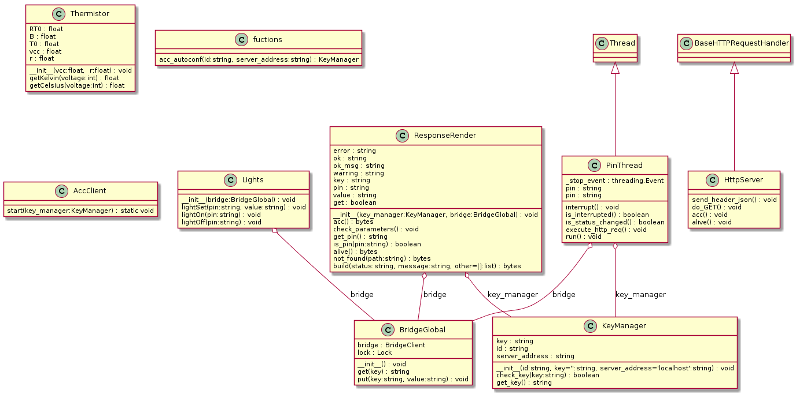

<div style="font-size:36px;text-align:center">
    <br><br><br><br><br>
    <small style="font-size:18px;">Guida Modulo</small><br>
    ACC
</div>

<div class="page-break"></div>

<div class="clearfix index">
    <div class="capitle" style="width:80%;float:left;border-bottom:1px dotted #DDDDDD;"><h5>Capitolo</h5></div>
    <div class="page" style="text-align:right;width:20%;float:left;border-bottom:1px dotted #DDDDDD;"><h5>Pagina</h5></div>
    <div style="margin-top:5px;widht:100%;"> </div>
    <div class="capitle" style="width:80%;float:left;border-bottom:1px dotted #DDDDDD;">Indice</div>
    <div class="page" style="text-align:right;width:20%;float:left;border-bottom:1px dotted #DDDDDD;">2</div>
    <div class="capitle" style="width:80%;float:left;border-bottom:1px dotted #DDDDDD;">ACC (Arduino Connection Controller)</div>
    <div class="page" style="text-align:right;width:20%;float:left;border-bottom:1px dotted #DDDDDD;">3</div>
            <div class="capitle" style="width:80%;float:left;border-bottom:1px dotted #DDDDDD;">
                &emsp;&emsp;ACC-Server - autoconf
            </div>
            <div class="page" style="text-align:right;width:20%;float:left;border-bottom:1px dotted #DDDDDD;">3</div>
            <div class="capitle" style="width:80%;float:left;border-bottom:1px dotted #DDDDDD;">
                &emsp;&emsp;ACC-Server - set
            </div>
            <div class="page" style="text-align:right;width:20%;float:left;border-bottom:1px dotted #DDDDDD;">4</div>
                <div class="capitle" style="width:80%;float:left;border-bottom:1px dotted #DDDDDD;">
                    &emsp;&emsp;&emsp;ACC-Server - set toggle
                </div>
                <div class="page" style="text-align:right;width:20%;float:left;border-bottom:1px dotted #DDDDDD;">4</div>
            <div class="capitle" style="width:80%;float:left;border-bottom:1px dotted #DDDDDD;">
                &emsp;&emsp;ACC-Server - il codice
            </div>
            <div class="page" style="text-align:right;width:20%;float:left;border-bottom:1px dotted #DDDDDD;">4</div>
    <div style="margin-top:5px;widht:100%;"> </div>
    <div class="capitle" style="width:80%;float:left;border-bottom:1px dotted #DDDDDD;">ACC-Client (Arduino Connection Controller - Client)</div>
    <div class="page" style="text-align:right;width:20%;float:left;border-bottom:1px dotted #DDDDDD;">5</div>
        <div class="capitle" style="width:80%;float:left;border-bottom:1px dotted #DDDDDD;">
            &emsp;&emsp;ACC-Client-ID
        </div>
        <div class="page" style="text-align:right;width:20%;float:left;border-bottom:1px dotted #DDDDDD;">5</div>
        <div class="capitle" style="width:80%;float:left;border-bottom:1px dotted #DDDDDD;">
            &emsp;&emsp;ACC-Client-Key
        </div>
        <div class="page" style="text-align:right;width:20%;float:left;border-bottom:1px dotted #DDDDDD;">5</div>
        <div class="capitle" style="width:80%;float:left;border-bottom:1px dotted #DDDDDD;">
            &emsp;&emsp;ACC-Client - alive
        </div>
        <div class="page" style="text-align:right;width:20%;float:left;border-bottom:1px dotted #DDDDDD;">5</div>
        <div class="capitle" style="width:80%;float:left;border-bottom:1px dotted #DDDDDD;">
            &emsp;&emsp;ACC-Client - set
        </div>
        <div class="page" style="text-align:right;width:20%;float:left;border-bottom:1px dotted #DDDDDD;">5</div>
        <div class="capitle" style="width:80%;float:left;border-bottom:1px dotted #DDDDDD;">
            &emsp;&emsp;ACC-Client - get
        </div>
        <div class="page" style="text-align:right;width:20%;float:left;border-bottom:1px dotted #DDDDDD;">6</div>
        <div class="capitle" style="width:80%;float:left;border-bottom:1px dotted #DDDDDD;">
            &emsp;&emsp;ACC-Client - il codice
        </div>
        <div class="page" style="text-align:right;width:20%;float:left;border-bottom:1px dotted #DDDDDD;">6</div>
</div>

<div class="page-break"></div>

# ACC (Arduino Connection Controller)

&Egrave; un protocollo che abbiamo ideato per comunicare con facilita con l'Arduino,
mentre lo stavamo progettando ci siamo accorti che questo protocollo pu&ograve; essere esteso per
qualunque micro controllore che possa essere connesso ad una rete LAN, siccome &egrave; basato sul
protocollo HTTP, per poterlo utilizzare basta un server HTTP personalizzato ed un client HTTP per
eseguire le richieste al server ACC.  
Il server HTTP e il client, sono entrambi sia sul server ACC che sul client ACC (Microcontrollore).  
Per semplicit&agrave; il server verr&agrave; chiamato `ACC-Server` mentre il lato client verr&agrave;
denominato `ACC-Client`.

Questo protocollo, come un modulo a se stante, dal progetto `domotics`, quindi potrà venir
utilizzato anche da altri progetti.  
L'idea del funzionamento di questo modulo, &egrave; poter inviare dei valori da settare sui pin,
oppure richiedere lo stato dei pin. Questo protocollo deve funzionare in maniera "sicura" se vi
&egrave; presente un ACC-Server, oppure in maniera autonoma se il suo server.

La modalit&agrave; `sicura` utilizza una chiave per scambiare i valori fra l'ACC-Client e
l'ACC-server, la chiave &egrave; una stringa esadecimale di 12 caratteri. Quando la modali&agrave;
sicura &egrave; abilitata, per richiedere i valori al microcontrollore o settare dei valori sui pin,
mentre nella modalit&agrave; senza l'ACC-Server, chiunque conosce l'indirizzo IP del server ed il
funzionamento del protocollo pu&ograve; inviare comandi o richiedere valori all'ACC-Client.

## ACC-Server (Arduino Connection Controller - Server)

L'ACC-Server, &egrave; composto di un server HTTP ed un elemento per creare le richieste HTTP. Il
server HTTP, ha bisogno di una pagina, la quale deve essere in grado di interpretare due richiste:
- autoconf: Questa richiesta richiede tramite il suo ID, la quale ritorna la chiave di comunicazione.
- set: Questa richiesta deve contenere, la chiave di comunicazione, il pin ed il valore, questa
serve per aggiornare l'ACC-Server nel caso in cui un pin (per esempio bottone), cambia stato.  
L'ACC-Server, si basa sul un database, che viene utilizzato per risolvere le richieste, per esempio
quale input deve accendere o spegnere quale luce. Per il database &egrave; stata fatta una guida
apposita: `doc/Documentazione/Guide/GuidaFunzionamentoDatabase.md`.

### ACC-Server - autoconf

La richiesta deve essere:

```
http://<serverAddress>:<serverPort>/acc?autoconf&id=<ACC-Client-ID>
```

E la risposta sar&agrave;

```
{"id":"<ACC-Client-ID>", "key":"<ACC-Client-KEY>", "server_address":"<serverAddress>:<serverPort>"}
```

Tutte le risposte saranno inviate in formato JSON, questo per facilitare il l'interpretazione da
parte del client.

<small>ACC-Client-ID e ACC-Client-KEY sono spiegati nel capitolo successivo</small>

### ACC-Server - set

Quando cambia lo stato di un pin digitale di input sull'arduino, (per esempio la pressione di un
bottone) questo deve notificarlo al server, per permettere al server di eseguire le guiste
operazioni, per esempio modificare lo stato di altri pin.

La richiesta deve essere:

```
http://<serverAddress>:<serverPort>/acc?key=<ACC-Client-KEY>&pin=<changedPin>&set=<pinStatus>
```

La risposta sar&agrave;:

```
{"status":"OK","message":"<valoreSettato>"}
```

#### ACC-Server - set toggle

In alcuni casi potrebbe essere comodo avere una funzione toggle, per esempio per i bottoni, eseguire
la richiesta `set`, la quale semplicemente indica che il pin ha cambiato stato. Per eseguire questa
richiesta:

```
http://<serverAddress>:<serverPort>/acc?key=<ACC-Client-KEY>&pin=<chang>&set=toggle
```

La risposta sar&agrave;:

```
{"status":"OK","message":"<valoreSettato>"}
```

### ACC-Server - il codice

Nel caso di domotics l'ACC-Server, &egrave; stato implementato in java, per poterlo integrare
direttamente con il modulo del web e per riutilizzare in questi due ambienti gli
stessi modelli dei dati.

Quindi &egrave; stata creata una pagina del web server, con le funzionalit&agrave; dell'ACC-Server
(`src/acc/AccServlet.java`), la quale sar&agrave; resa disponibile dal webserver all'indirizzo:
`http://<serverAddress>:<serverPort>/acc`.

<div class="page-break"></div>

## ACC-Client (Arduino Connection Controller - Client)

Anche L'ACC-Client, &egrave; composto di un server HTTP ed un client, il server rimane in ascolto
sulla porta `8080`, per la ricezione delle richieste dell'ACC-Server, mentre il client esegue le
richieste all'ACC-Server, quando cambia lo stato di un bottone (o di un pin digitale di input).

### ACC-Client-ID

Codice identificativo di un ACC-Client, formato da 12 numeri esadecimali:

```
1234567890ABCD
```

### ACC-Client-KEY

&Egrave; un codice di comunicazione fra il ACC-Client e ACC-Server, viene utilizzato per riconoscere
che le informazioni sono autentiche. Questa viene generata dal ACC-Server ed inviata al client al
momento della configuazione. Anch'essa è formata da 12 numeri esadecimali:

```
1234567890ABCD
```

### ACC-Client - alive

Per controllare che l'arduino sia attivo e funzioni correttamente, per il quale eseguire la seguente
richiesta:

```
http://<ACC-ClientIP>:<ACC-ClientPort>/alive
```

La relativa risposta sar&agrave;:

```
{"status":"OK"}
```

### ACC-Client - set

Per settare il dei valori sui pin di output del arduino, eseguire la seguente richiesta
all'ACC-Client:

```
http://<ACC-ClientIP>:<ACC-ClientPort>/acc?key=<ACC-Client-KEY>&pin=<pinToSet>&set=<valueToSet>
```

La relativa risposta sar&agrave;:

```
{"status":"OK","message":"<settedValue>"}
```

<div class="page-break"></div>

### ACC-Client - get

Per richiedere all'arduino dei valori di dei pin di input o output, bisogna eseguire la seguente
richiesta all'ACC-Client:

```
http://<ACC-ClientIP>:<ACC-ClientPort>/acc?key=<ACC-Client-KEY>&pin=<requiredPin>
```

La relativa risposta sar&agrave;:

```
{"status":"OK","message":"<value>"}
```

### ACC-Client - il codice

Nel caso dell'ACC-Client il codice &egrave; stato scritto in python, siccome l'Arduino Y&Uacute;N
(Lilino) permette di scrivere il codice in python ed eseguirlo a stretto contatto con il codice sul
lato Arduino. Per una spiegazione pi&ugrave; accurata del funzionamento dell'Arduino, usare la guida
`doc/Documentazione/Guide/arduinoYun.md`.

Principalmente il codice &egrave; strutturato in due parti, il codice eseguito sull'Arduino, che
semplicemente aggiorna lo stato dei pin di output (prendendo i valori dal Bridge condiviso con la
parte Lilino) e aggiorna lo stato del bridge con i pin di input. Codice:
`ino/ACC-Client.ino/ACC-Client.ino.ino`.  
Mentre il codice relativo a Lilino, si occupa di eseguire il web server, esaudire le richieste
dell'ACC-Server e di inviare al server, i cambiamenti dei pin di input, come quelli dei bottoni. Il
codice: `py/acc-client.py/`. Il tutto &egrave; strutturato come mostrato nell'immagine sottostante,
che rappresenta il diagramma delle classi.

<div class="page-break"></div>

<br><br><br><br><br><br><br><br><br><br><br><br>
<div style="-webkit-transform: rotate(90deg);-moz-transform: rotate(90deg);-o-transform: rotate(90deg);-ms-transform: rotate(90deg);transform: rotate(90deg);width:650px;">
    
</div>
