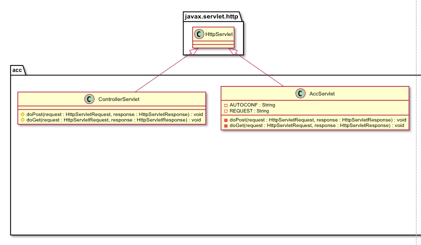
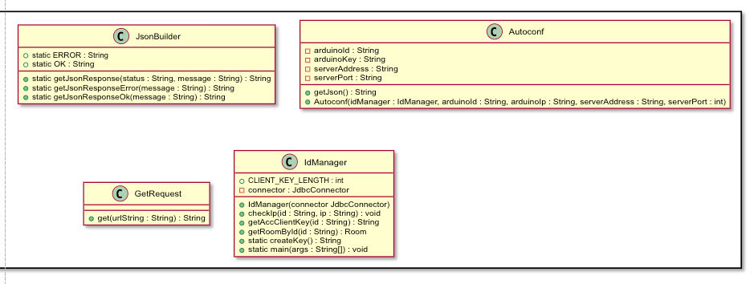
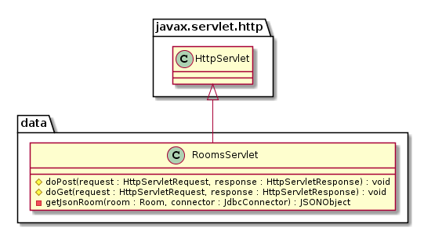

<div style="font-size:36px;text-align:center">
    <br><br><br><br><br>
    <small style="font-size:18px;">Guida Modulo</small><br>
    back-end
</div>

<div class="page-break"></div>

<div class="clearfix index">
    <div class="capitle" style="width:80%;float:left;border-bottom:1px dotted #DDDDDD;"><h5>Capitolo</h5></div>
    <div class="page" style="text-align:right;width:20%;float:left;border-bottom:1px dotted #DDDDDD;"><h5>Pagina</h5></div>
    <div style="margin-top:5px;widht:100%;"> </div>
    <div class="capitle" style="width:80%;float:left;border-bottom:1px dotted #DDDDDD;">Indice</div>
    <div class="page" style="text-align:right;width:20%;float:left;border-bottom:1px dotted #DDDDDD;">2</div>
    <div class="capitle" style="width:80%;float:left;border-bottom:1px dotted #DDDDDD;">Introduzione</div>
    <div class="page" style="text-align:right;width:20%;float:left;border-bottom:1px dotted #DDDDDD;">3</div>
    <div class="capitle" style="width:80%;float:left;border-bottom:1px dotted #DDDDDD;">Design</div>
    <div class="page" style="text-align:right;width:20%;float:left;border-bottom:1px dotted #DDDDDD;">3</div>
        <div class="capitle" style="width:80%;float:left;border-bottom:1px dotted #DDDDDD;">&emsp;LDAP</div>
        <div class="page" style="text-align:right;width:20%;float:left;border-bottom:1px dotted #DDDDDD;">3</div>
        <div class="capitle" style="width:80%;float:left;border-bottom:1px dotted #DDDDDD;">&emsp;JDBC</div>
        <div class="page" style="text-align:right;width:20%;float:left;border-bottom:1px dotted #DDDDDD;">4</div>
        <div class="capitle" style="width:80%;float:left;border-bottom:1px dotted #DDDDDD;">&emsp;Modelli database</div>
        <div class="page" style="text-align:right;width:20%;float:left;border-bottom:1px dotted #DDDDDD;">4</div>
        <div class="capitle" style="width:80%;float:left;border-bottom:1px dotted #DDDDDD;">&emsp;ACC-Server</div>
        <div class="page" style="text-align:right;width:20%;float:left;border-bottom:1px dotted #DDDDDD;">6</div>
        <div class="capitle" style="width:80%;float:left;border-bottom:1px dotted #DDDDDD;">&emsp;Dati per front-end (JSON)</div>
        <div class="page" style="text-align:right;width:20%;float:left;border-bottom:1px dotted #DDDDDD;">7</div>
    <div class="capitle" style="width:80%;float:left;border-bottom:1px dotted #DDDDDD;">Implementazione</div>
    <div class="page" style="text-align:right;width:20%;float:left;border-bottom:1px dotted #DDDDDD;">8</div>
        <div class="capitle" style="width:80%;float:left;border-bottom:1px dotted #DDDDDD;">&emsp;LDAP</div>
        <div class="page" style="text-align:right;width:20%;float:left;border-bottom:1px dotted #DDDDDD;">8</div>
        <div class="capitle" style="width:80%;float:left;border-bottom:1px dotted #DDDDDD;">&emsp;JDBC</div>
        <div class="page" style="text-align:right;width:20%;float:left;border-bottom:1px dotted #DDDDDD;">8</div>
        <div class="capitle" style="width:80%;float:left;border-bottom:1px dotted #DDDDDD;">&emsp;Modelli database</div>
        <div class="page" style="text-align:right;width:20%;float:left;border-bottom:1px dotted #DDDDDD;">8</div>
        <div class="capitle" style="width:80%;float:left;border-bottom:1px dotted #DDDDDD;">&emsp;ACC-Server</div>
        <div class="page" style="text-align:right;width:20%;float:left;border-bottom:1px dotted #DDDDDD;">9</div>
        <div class="capitle" style="width:80%;float:left;border-bottom:1px dotted #DDDDDD;">&emsp;Dati per front-end (JSON)</div>
        <div class="page" style="text-align:right;width:20%;float:left;border-bottom:1px dotted #DDDDDD;">9</div>
</div>

<div class="page-break"></div>

# back-end

L'unione di tutti i moduli del progetto avviene nel back-end, il quale deve collegare il front-end,
cio&eacute; la web-app, il database di domotics, e i micro controllor (nel nostro caso Arduino),
tramite l'ACC.

Il back-end &egrave; scritto in java, e verr&agrave; servito da tomcat, come web server.

## Design

Il back-end, &egrave; stato progettato in pi&ugrave; fasi, modulo per modulo.

#### LDAP

Il primo modulo ad essere stato progettato &egrave; stato quello di `ldap` e dell'autenticazione,
che si compone delle classi:

- `LdapConnector`, gestisce le connessioni con il server ldap.
- `Authenticator`, &egrave; un interfaccia creata per poter utilizzare diversi tipi di autenticazione
con facilit&agrave;
- `LdapAuthenticator`, classe per autenticarsi con ldap, implementa `Authenticator`.
- `AuthenticationChecker`, una classe utilizzata per convalidare le sessioni HTTP.
- `LoginServlet`, servlet per eseguire il login della sessione HTTP.
- `LogoutServlet`, servlet per invalidare la sessione HTTP.


<div class="page-break"></div>

#### JDBC

Dopo di che &egrave; stato progettato il modulo relativo al database, quindi l'utilizzo di JDBC, il
driver per connnettersi ai database MySQL con Java.  
Il quale &egrave; composto delle seguenti classi:

- `JdbcConnector`, gestisce le connessioni al server MySQL, per poter funzionare necessita che vi
sia presente la libreria `mysql-connector-java-8.0.13.jar`.
- `DomoticsJdbcC`, &egrave; una classe che istanzia `JdbcConnector` nella maniera corretta per
questo progetto.


#### Modelli database

Dopo aver progettato il modulo della connessione al database, sono state progettate le classi che
rappresentano le istanze dei database e che ci interaggiscono direttamente.  
Per ogni tabella del database, &egrave; stata creata una classe. La quale servir&agrave; per aiutare
l'interazione con il database e gli altri moduli. Le classi sono:

<div class="page-break"></div>

<br><br><br><br><br><br>
<div style="-webkit-transform: rotate(90deg);-moz-transform: rotate(90deg);-o-transform: rotate(90deg);-ms-transform: rotate(90deg);transform: rotate(90deg);width:650px;">
    
</div>

<div class="page-break"></div>

#### ACC-Server

Dopo aver progettato le classi modello per il database, &egrave; stato progettato il modulo dell'ACC
lato server, sono state progettate le classi di cui avrebbe necessitato, per poter funzionare
correttamente con gli elementi gi&agrave; esistenti. Queste classi sono state studiate, in maniera
da mantenere i vari elementi pi&ugrave; separati possibile, cos&igrave; da poter sostituire o
modificare i vari elementi pi&ugrave; facilmente possibile. Infatti le richieste vengono
interpretate dalla servlet (`AccServlet`), i controlli sui micro controllori vengono eseguiti dalla
classe preposta (`IdManager`), le richieste HTTP ai microcontrollori vengono eseguite tramite la
classe `GetRequest` e le configurazioni per i microcontrollori vengono generate dal `Autoconf`.





<div class="page-break"></div>

#### Dati per front-end (JSON)

Da ultimo &egrave; stato progettato il modulo relativo ai dati, i dati da inviare al front-end. Che
&egrave; composto dalla classe `RoomsServlet`, in futuro potrebbe venir anche ingrandito.
Questa classe, semplicemente richiede al dababase (tramite le classi modello), tutte le `Room`, con
le relative luci. E trasforma tutto in un file JSON, che viene inviato come risposta.



<div class="page-break"></div>

## Implementazione

Per quanto riguarda l'Implementazione, &egrave; stato un processo, che ha preso tempo, ed &egrave;
stato fatto durante la progettazione degli altri moduli, quando un modulo veniva progettato, veniva
subito implementato e nel frattempo si progettava l'altro modulo. Questo perch&egrave; l'obbiettivo
era mantenerli indipendenti, utilizzando questo approccio eravamo anche pi&ugrave; liberi di
scegliere l'attivit&agrave; da fare potendo spaziare tra progettazione ed implementazione.

#### LDAP

Per il modulo di LDAP la parte complicata &egrave; quella di costruire la stringa di connessione
tramite la `Hashtable`.

```java
/**
 * Get the hashtable environment of the connection.
 *
 * @param username Username of the connection.
 * @param password Password of the connection.
 * @return Hashtable Environment of the connection.
 */
private Hashtable<String, String> getEnvironment(String username, String password) {
    Hashtable<String, String> environment = new Hashtable<String, String>();

    environment.put(Context.INITIAL_CONTEXT_FACTORY, DEFAULT_INITIAL_CONTEXT_FACTORY);
    environment.put(Context.PROVIDER_URL, getConnectionString());
    environment.put(Context.SECURITY_AUTHENTICATION, getSecurity());
    environment.put(Context.SECURITY_PRINCIPAL, getDn(username));
    environment.put(Context.SECURITY_CREDENTIALS, password);

    return environment;
}
```

La quale viene creata in un metodo dedicato.

#### JDBC

Nell'implementazione del modulo di JDBC, i punti complicati, sono:
- inserire la libreria in maniera che il sistema ne possa fare uso
- creare la giusta stringa di connessione, per la quale abbiamo utilizzato un trucchetto per evitare
problemi con gli orari non sincronizzati fra web-server, e server MySQL.

Il driver di JDBC (libreria) va inserito come libreria esterna del progetto (quando si lavora su
IntelliJ IDEA), mentre per il server nelle librerie di tomcat.

Mentre per creare la stringa di connessione, bisogna inserire il driver (`jdbc`), il protocollo
(`mysql`), l'host, la porta ed il nome del database. Infine aggiungere un `?` con la stringa
dell'orario UTC.

```java
final String TIMEZONE_UTC = "useUnicode=true&useJDBCCompliantTimezoneShift=true&useLegacyDatetimeCode=false&serverTimezone=UTC";
String connectionString = "jdbc:mysql://" + host + ":" + port + "/" + database + "?";
connectionString += TIMEZONE_UTC;
```

#### Modelli database

Per i modelli del database, sono semplicemente state riprese le tabelle del database, e scritti i
relativi oggetti. Dopo di che, sono stati aggiunti alcuni metodo per eseguire pi&ugrave; facilmente
determinate operazioni.

<div class="page-break"></div>

#### ACC-Server

Per l'ACC-Server sono state implementate le varie classi, le sono principalmente `IdManager`, che
si occupa di controllare che siano autentici gli Id, gli Ip e le key dei microcontrollori, e la
classe AccServlet, che si occupa soddisfare le richieste provenienti dall'ACC-Client.

#### Dati per il front-end (JSON)

Per la genrazione del file JSON da ritornare al front-end come dati, la maggior parte di questo
processo avviene nel metodo `getJsonRoom()` della classe `RoomsServlet`, il quale richiede lo stato
di tutte le luci, la temperatura della stanza, il nome della stanza e crea un oggetto JSON, il quale
verr&agrave; aggiunto ad un'array di oggetti JSON, che infine verr&agrave; ritornato come stringa al
front-end.

```java
private JSONObject getJsonRoom(Room room, JdbcConnector jdbc) throws SQLException, ClassNotFoundException, IOException {
    JSONObject roomJson = new JSONObject();

    JSONArray lights = Light.getJsonLights(Light.getLights(jdbc, new Room(room.getName())));

    roomJson.put("lights", lights);
    roomJson.put("name", room.getName());
    roomJson.put("temp", Thermometer.getTemperatureByRoom(room, jdbc) + "");

    return roomJson;
}
```
