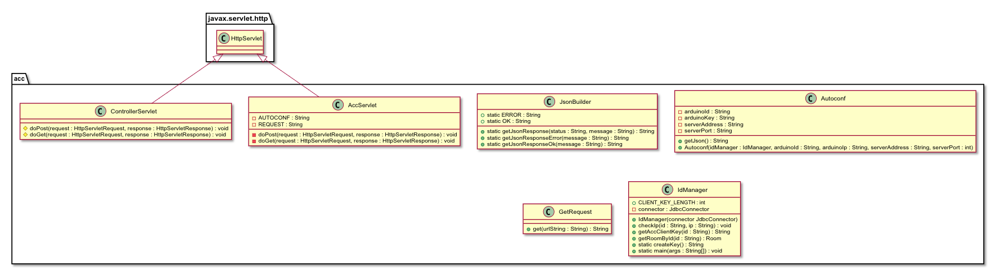

# back-end

L'unione di tutti i moduli del progetto avviene nel back-end, il quale deve collegare il front-end,
cio&eacute; la web-app, il database di domotics, e i micro controllor (nel nostro caso Arduino),
tramite l'ACC.

Il back-end &egrave; scritto in java, e verr&agrave; servito da tomcat, come web server.

## Design

Il back-end, &egrave; stato progettato in pi&ugrave; fasi, modulo per modulo. Il primo modulo ad
essere stato progettato &egrave; stato quello di `ldap` e dell'autenticazione, che si compone delle
classi:

- `LdapConnector`, gestisce le connessioni con il server ldap.
- `Authenticator`, &egrave; un interfaccia creata per poter utilizzare diversi tipi di autenticazione
con facilit&agrave;
- `LdapAuthenticator`, classe per autenticarsi con ldap, implementa `Authenticator`.
- `AuthenticationChecker`, una classe utilizzata per convalidare le sessioni HTTP.
- `LoginServlet`, servlet per eseguire il login della sessione HTTP.
- `LogoutServlet`, servlet per invalidare la sessione HTTP.

Dopo di che &egrave; stato progettato il modulo relativo al database, quindi l'utilizzo di JDBC, il
driver per connnettersi ai database MySQL con Java.  
Il quale &egrave; composto delle seguenti classi:

- `JdbcConnector`, gestisce le connessioni al server MySQL, per poter funzionare necessita che vi
sia presente la libreria `mysql-connector-java-8.0.13.jar`.
- `DomoticsJdbcC`, &egrave; una classe che istanzia `JdbcConnector` nella maniera corretta per
questo progetto.

Dopo aver progettato il modulo della connessione al database, sono state progettate le classi che
rappresentano le istanze dei database e che ci interaggiscono direttamente.  
Per ogni tabella del database, &egrave; stata creata una classe. La quale servir&agrave; per aiutare
l'interazione con il database e gli altri moduli. Le classi sono:

Dopo aver progettato le classi modello per il database, &egrave; stato progettato il modulo dell'ACC
lato server, sono state progettate le classi di cui avrebbe necessitato, per poter funzionare
correttamente con gli elementi gi&agrave; esistenti. Queste classi sono state studiate, in maniera
da mantenere i vari elementi pi&ugrave; separati possibile, cos&igrave; da poter sostituire o
modificare i vari elementi pi&ugrave; facilmente possibile. Infatti le richieste vengono
interpretate dalla servlet (`AccServlet`), i controlli sui micro controllori vengono eseguiti dalla
classe preposta (`IdManager`), le richieste HTTP ai microcontrollori vengono eseguite tramite la
classe `GetRequest` e le configurazioni per i microcontrollori vengono generate dal `Autoconf`.

