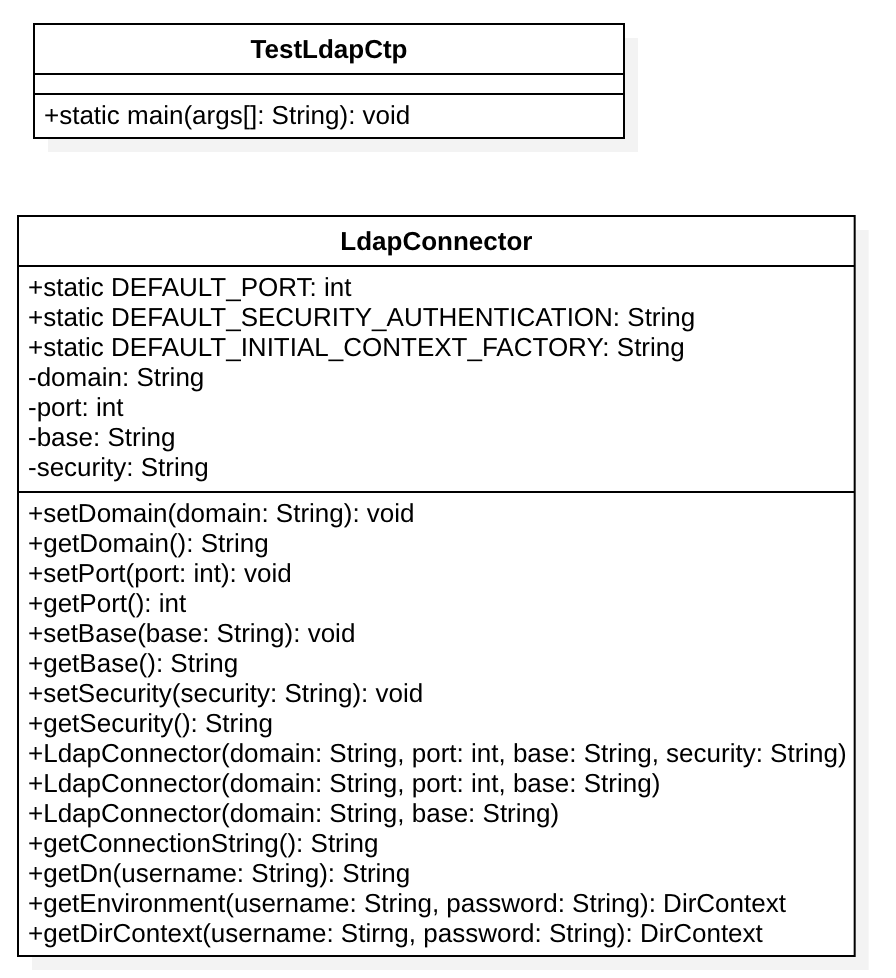

<div style="font-size:36px;text-align:center">
    <br><br><br><br><br>
    <small style="font-size:18px;">Guida Modulo</small><br>
    ldap
</div>

<div class="page-break"></div>

<div class="clearfix index">
    <div class="capitle" style="width:80%;float:left;border-bottom:1px dotted #DDDDDD;"><h5>Capitolo</h5></div>
    <div class="page" style="text-align:right;width:20%;float:left;border-bottom:1px dotted #DDDDDD;"><h5>Pagina</h5></div>
    <div style="margin-top:5px;widht:100%;"> </div>
    <div class="capitle" style="width:80%;float:left;border-bottom:1px dotted #DDDDDD;">Indice</div>
    <div class="page" style="text-align:right;width:20%;float:left;border-bottom:1px dotted #DDDDDD;">2</div>
    <div class="capitle" style="width:80%;float:left;border-bottom:1px dotted #DDDDDD;">Progettazione</div>
    <div class="page" style="text-align:right;width:20%;float:left;border-bottom:1px dotted #DDDDDD;">3</div>
    <div class="capitle" style="width:80%;float:left;border-bottom:1px dotted #DDDDDD;">Implementazione</div>
    <div class="page" style="text-align:right;width:20%;float:left;border-bottom:1px dotted #DDDDDD;">4</div>
</div>

<div class="page-break"></div>

# Guida Lightweight Directory Access Protocol

## Progettazione

Per connetterci al database della scuola abbiamo deciso di utilizzare LDAP Connector perché era la
soluzione più facile e sicura da implementare dato che passi le credenziali per entrare nel database
alla scuola, gli dici cosa vuoi sapere e fa tutto lui così nessuno accede direttamente sul database
per evitare problemi.

<div style="text-align:center;">
    <br><br>
</div>

La classe LdapConnector viene utilizzata nel login, infatti quando l'utente si loggerà le
credenziali che mette vengono prese e e vengono confrontate con le credenziali del database della
scuola dove vede se l'utente è un docente e quindi ha i permessi per accederci o è un allievo e
quindi non ha i permessi. LDAP permette di mantenere anche una certa sicurezza essendo che la
comunicazione &egrave; criptata.
Nella classe ci saranno i seguenti attributi statici: la porta di default del server, la chiave di
autenticazione, e una variabile che rappresenta il contesto iniziale del LDAP. Poi nelle variabili
domain viene salvato il dominio del server LDAP, nella variabile port la porta del server se è
diversa da quella di dafault, la variabile base rappresenta il livello del server nelle unità
organizzative dove deve andare a controllare le credenziali e security rappresenta il tipo di
sicurezza che viene utilizzata per connettersi. Nella classe vengono implementati poi tutti i vari
get e set per settare o ritornare i valori delle variabili, ci sono tre costruttori, uno a cui viene
passato il dominio, la porta, l'unità organizzativa e il tipo di sicurezza, uno a cui non viene
passato il tipo di sicurezza e nel terzo viene passato solo il dominio e l'unità organizzativa. Il
metodo getEnvironment ritorna l'ambiente hashtable della connessione, getConnectionString ritorna la
stringa di connessione, getDN ritorna una stringa con le credenziali e l'unita organizzativa da
inviare nel metodo getEnvironment per creare la connessione, e getDirContext ritorna se l'utente ha
i permessi o no.

## Implementazione

Nella nostra classe sono presenti cinque costruttori, uno a cui gli viene la stringa rappresentante
il dominio, la porta, la stringa rappresentante il percorso dell'unità organizzativa dove andare a
confrontare gli account presenti con quello del login e la stringa security che contiene il livello
di sicurezza dell'autentificazione. Il secondo costruttore è uguale ma non gli viene passata la
stringa di autentificazione e viene usato il valore di default "simple", nel terzo gli vengono
passati solo dominio, percorso e porta, nel quarto costruttore solo il dominio, il percorso e il
livello di sicurezza dell'autentificazione e nll'ultimo gli viene pasatto solo il dominio e il percorso.

```java
public LdapConnector(String domain, int port, String base, String security) throws IOException {
    this.setDomain(domain);
    this.setBase(base);
    this.setPort(port);
    this.setSecurity(security);
}

public LdapConnector(String domain, int port, String base) throws IOException {
    this(domain, port, base, DEFAULT_SECURITY_AUTHENTICATION);
}

/**
 * Create the LDAP connector.
 *
 * @param domain   LDAP server address.
 * @param base     LDAP base ou.
 * @param security LDAP Security type.
 */
public LdapConnector(String domain, String base, String security) {
    try {
        this.setDomain(domain);
        this.setBase(base);
        this.setPort(DEFAULT_PORT);
        this.setSecurity(security);
    } catch (IOException ignored) {
        // ignored because the default port is in the range (and it's a constant).
    }
}

/**
 * Create the LDAP connector.
 *
 * @param domain LDAP server address.
 * @param base   LDAP base ou.
 */
public LdapConnector(String domain, String base) {
    this(domain, base, DEFAULT_SECURITY_AUTHENTICATION);
}
```

Il metodo getConnectionString come dice il nome ritorna la stringa di connessione, molto
semplicamente prende il percorso di ldap nella rete e ci aggiunge il domionio e la porta.

```java
private String getConnectionString() {
    return "ldap://" + getDomain() + ":" + getPort();
}
```

<div class="page-break"></div>

Questo metodo viene utilizzato per creare e poi ritornare DN, è simile a un percorso assoluto solo c
he invece di scendere l'albero da sinistra scende da destra.  
Ecco un esempio di DN:  
CN=john.doe,OU=People,DC=example,DC=com  
CN è il nome utente, OU è l'unita organizzativa a cui deve puntare (che possono essere più di una)
mentre il primo DC rappresenta le componenti del dominio.  
Per creare il DN prendiamo l'username e lo uniamo con il percorso dell'unità organizzativa che
ricaviamo con getBase();

```java
private String getDn(String username) {
    return "CN=" + username + "," + getBase();
}
```

Il metodo sottostante si occupa di creare una Hashtable che contiene tutti i parametri che poi
verranno inviati.  
I parametri che andranno inviati sono:  

- DEFAULT_INITIAL_CONTEXT_FACTORY, Connessione iniziale predefinita del contesto iniziale di fabbrica.
- getConnectionString(), stringa di connessione.
- getDn(username), percorso a cui deve puntare.
- password, con cui si è tentato di accedere e che deve essere controllata.

```java
private Hashtable<String, String> getEnvironment(String username, String password) {
    Hashtable<String, String> environment = new Hashtable<String, String>();

    environment.put(Context.INITIAL_CONTEXT_FACTORY, DEFAULT_INITIAL_CONTEXT_FACTORY);
    environment.put(Context.PROVIDER_URL, getConnectionString());
    environment.put(Context.SECURITY_AUTHENTICATION, getSecurity());
    environment.put(Context.SECURITY_PRINCIPAL, getDn(username));
    environment.put(Context.SECURITY_CREDENTIALS, password);

    return environment;
}
```

Quest'ultimo metodo invece utilizza l'Hashtable per collegarsi e controllare se l'utente è presente
all'interno dell'unità organizzativa a cui gli è stato detto di andare a controllare poiché al
metodo gli viene passato sia l'username che la password che poi richiama il metodo per fare
l'Hashtable.  
Se l'autenticazione è valida continua altrimenti richiama un eccezione.

```java
public DirContext getDirContext(String username, String password) throws NamingException {
    return new InitialDirContext(getEnvironment(username, password));
}
```
